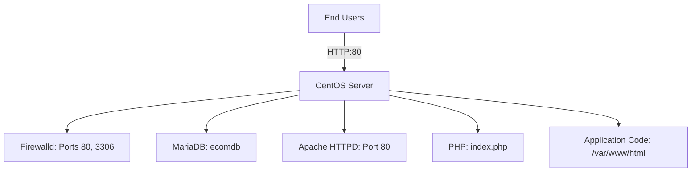
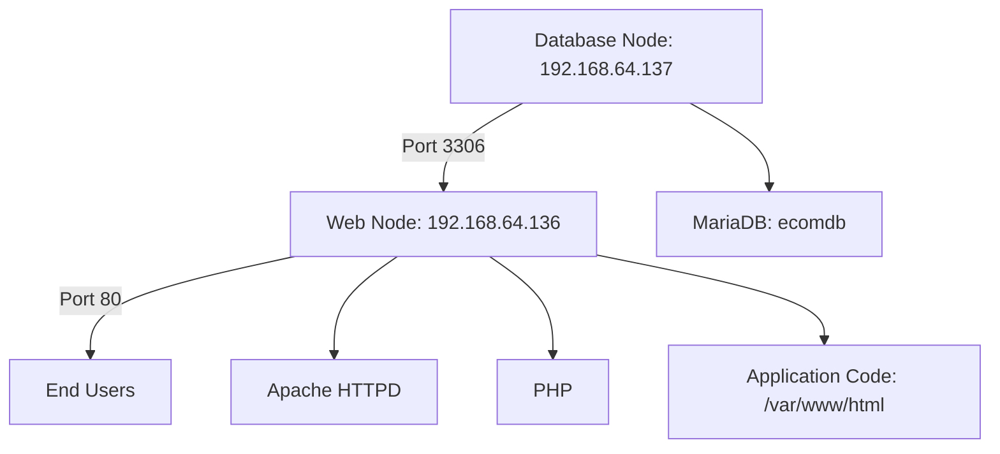

# Introduction to Ansible

Ansible is a powerful, open-source automation tool that streamlines IT operations, making it easier to manage configuration, deploy applications, and orchestrate complex infrastructures. Its design emphasizes simplicity, scalability, and security, which makes it ideal for both beginners and experienced IT professionals.


## What is Ansible?

Ansible automates repetitive IT tasks and ensures that systems are configured consistently across environments. It uses a straightforward, human-readable declarative language (YAML) to describe automation tasks, which allows you to define the desired state of your systems with ease.

### Key Features

- **Agentless Architecture:**  
  Ansible requires no agents on target machines; it leverages SSH (or WinRM for Windows) to manage systems directly.
  
- **Declarative Playbooks:**  
  Automation tasks are defined in YAML playbooks that are both easy to write and understand.
  
- **Idempotency:**  
  Tasks are designed to be idempotent, meaning that applying them multiple times produces the same result without adverse side effects.
  
- **Extensibility:**  
  A vast ecosystem of modules and plugins lets you extend Ansible’s functionality to meet your specific needs.

---

## Why Use Ansible?

Ansible addresses many of the common challenges in IT and DevOps by:

- **Automating Repetitive Tasks:**  
  Free up valuable time by automating processes like software installation and system configuration.
  
- **Ensuring Consistency:**  
  Prevent configuration drift by ensuring that every machine is set up exactly the same way.
  
- **Scaling Easily:**  
  Manage a few machines or thousands effortlessly—Ansible’s design supports environments of any size.
  
- **Facilitating Collaboration:**  
  Its clear, YAML-based syntax allows team members across different skill levels to contribute to automation efforts.
  
- **Simplifying Complexity:**  
  Ansible’s minimal setup and agentless design reduce overhead, making it easier to deploy and maintain.

---

## Ansible Architecture


Ansible's architecture is simple yet powerful, comprising the following components:

1. **Control Node:**  
   The machine where Ansible is installed. It runs playbooks, connects to managed nodes, and orchestrates automation tasks.
   
2. **Managed Nodes:**  
   The target systems that Ansible configures. They require only an SSH server and Python to operate.
   
3. **Inventory:**  
   A file (or dynamic source) that lists the hosts Ansible will manage. Inventories can be static (INI or YAML files) or dynamically generated.
   
4. **Playbooks:**  
   YAML files that define the tasks and the desired state of the systems. They provide a clear, step-by-step instruction set for Ansible to follow.
   
5. **Modules and Plugins:**  
   Modules perform tasks on managed nodes (like installing software or managing files), while plugins extend Ansible’s core functionality (such as custom logging or connection management).
   
6. **Facts:**  
   Automatically gathered system data that can be used in playbooks to tailor task execution dynamically.

### Workflow Overview

- **Initiation:**  
  The control node reads the inventory and playbooks.
  
- **Connection:**  
  Ansible establishes secure connections (via SSH or WinRM) to the managed nodes.
  
- **Execution:**  
  Modules specified in the playbooks run on the target systems, ensuring they reach the desired state.
  
- **Feedback:**  
  Results and system facts are collected and reported back to the control node.

---

## How Ansible Works

Ansible’s workflow is designed for clarity and efficiency:

1. **Define Inventory:**  
   List your hosts and groups in an inventory file.

2. **Write Playbooks:**  
   Create YAML files that describe the desired configuration and tasks.

3. **Run Playbooks:**  
   Execute the playbooks using the `ansible-playbook` command. Ansible connects to the managed nodes, performs the specified tasks, and returns detailed output.

4. **Secure Communication:**  
   All communication is securely managed via SSH (or WinRM for Windows), ensuring that your operations are both safe and reliable.

---

## Common Challenges and Considerations

While Ansible is user-friendly and powerful, there are a few challenges to be aware of:

- **Performance at Scale:**  
  SSH-based connections may slow down when managing thousands of nodes. Tuning parameters like `forks` can help mitigate this.
  
- **Learning Curve:**  
  New users might need time to become comfortable with YAML syntax and module usage.
  
- **Dependency on Python:**  
  Managed nodes require Python. This might require additional setup on minimal or older systems.
  
- **Error Handling:**  
  Although Ansible provides detailed error messages, debugging complex playbooks can sometimes be challenging.

---

## Installing Ansible

Before you can start automating your infrastructure, you need to install Ansible on a control node. Here are the common installation methods:

### On Linux

- **Ubuntu/Debian:**
  ```bash
  sudo apt update
  sudo apt install ansible -y
  ```
- **RHEL/CentOS:**
  ```bash
  sudo dnf install epel-release -y
  sudo dnf install ansible -y
  ```

### On macOS

Using Homebrew:
```bash
brew install ansible
```

### On Windows

Ansible is not natively supported on Windows as a control node, but you can:
- Use Windows Subsystem for Linux (WSL) to run a Linux distribution.
- Use a virtual machine running Linux.

### Verifying the Installation

After installation, check the version:
```bash
ansible --version
```

### Alternative Installation via pip

You can also install Ansible using the Python package manager:
```bash
pip install ansible
```

---

## SSH and Ansible

SSH is the primary protocol for Ansible’s communication between the control node and managed nodes. There are two common methods for SSH authentication:

### Password Authentication

Quick and simple, but less secure:
```yaml
ansible_user: your_username
ansible_ssh_pass: your_password
```

### SSH Key Authentication

Recommended for secure, passwordless authentication:
```yaml
ansible_user: your_username
ansible_ssh_private_key_file: /path/to/your/private/key
```

#### Generating an SSH Key

Generate a key pair and copy the public key to your managed nodes:
```bash
ssh-keygen -t rsa -b 4096 -C "ansible@example.com"
ssh-copy-id your_username@managed_node
```

#### Inventory Example with SSH Settings

Basic inventory configuration:
```ini
[webservers]
web1.example.com ansible_host=192.168.1.100 ansible_user=adminuser
web2.example.com ansible_host=192.168.1.101 ansible_user=adminuser
```

Advanced configuration in YAML:
```yaml
all:
  vars:
    ansible_ssh_common_args: '-o StrictHostKeyChecking=no'
  hosts:
    web1.example.com:
      ansible_host: 192.168.1.100
      ansible_user: adminuser
      ansible_ssh_private_key_file: /path/to/private/key
```

---

## Conclusion

Ansible simplifies IT automation by providing a lightweight, agentless, and scalable platform to manage your infrastructure. With its clear YAML syntax and modular design, Ansible empowers teams to automate tasks efficiently and reliably. Whether you're automating a few servers or managing a large-scale deployment, Ansible is a robust tool that can adapt to your needs and streamline your operations.

---
# Ansible Lab Environment Setup and Cloning Guide

This guide provides step-by-step instructions for setting up an Ansible lab environment using Oracle VirtualBox and a pre-configured CentOS image. It covers creating a template virtual machine, cloning it to create an Ansible controller and target machines, and installing Ansible on the controller.

---

## Part 1: Setting Up the Ansible Lab Environment

### Overview

- **Objective:**  
  Create a lab environment to experiment with Ansible by setting up a template virtual machine that you can later clone into multiple machines (for both controller and targets).

- **Key Tools:**  
  - **Oracle VirtualBox:** A free virtualization platform available for Windows, Linux, and macOS.  
  - **Pre-configured CentOS Image:** Downloaded from osboxes.org, this image provides a ready-to-use virtual disk file (`.vdi`).  
  - **SSH Client:** (e.g., MobaXterm or PuTTY) for remotely managing your virtual machines.

### Prerequisites

- A host machine running Windows, Linux, or macOS.
- Oracle VirtualBox installed.
- Virtualization enabled in your computer’s BIOS (to support 64-bit VMs).
- Extraction software (e.g., 7zip) to decompress the downloaded file.
- Access to the CentOS image from [osboxes.org](https://www.osboxes.org).

### Steps

1. **Install Oracle VirtualBox**
   - Download VirtualBox from [virtualbox.org](https://www.virtualbox.org).
   - Run the installer and follow the installation wizard.

2. **Download and Extract the CentOS Image**
   - Visit [osboxes.org](https://www.osboxes.org) and locate the VirtualBox images section.
   - Download the CentOS 7 (64-bit) image, provided as a compressed `.7z` file.
   - Extract the file using 7zip (or a similar tool) to locate the `.vdi` virtual disk image.

3. **Create a New Virtual Machine**
   - Open VirtualBox and click **New**.
   - Name your VM (e.g., `CentOS-template`), choose **Linux** as the type, and select **Other Linux (64-bit)**.
   - Allocate an appropriate amount of memory (e.g., 2 GB).
   - Instead of creating a new virtual hard disk, select **Use an existing virtual hard disk file** and browse to your extracted `.vdi` file.

4. **Configure Additional Settings**
   - **System Settings:** Increase the CPU count (e.g., set to 2).
   - **Network Settings:** Set the network adapter to **Bridged Adapter** so the VM obtains its own IP address and can access the internet.

5. **Boot and Verify the Template**
   - Start the VM.
   - Log in using the default credentials provided by osboxes.org:
     - **Username:** `osboxes`
     - **Password:** `osboxes.org`
   - Open a terminal inside the VM and run `ifconfig` to determine its IP address.
   - Optionally, establish an SSH connection from your host machine to verify remote access.
   - Shut down the VM once verified; this VM will serve as your template for cloning.

---

## Part 2: Cloning and Configuring Virtual Machines for Ansible

### Overview

This section details how to clone your template VM to create dedicated machines for the Ansible controller and targets. It covers renaming hostnames, ensuring each VM has a unique MAC address, and installing Ansible.

### Steps

1. **Clone the Template Virtual Machine**
   - With the template VM powered off, right-click on it in VirtualBox and select **Clone**.
   - **For the Ansible Controller:**
     - Name the clone `Ansible-controller`.
     - Check the **Reset MAC address** option to assign a new MAC address.
     - Select **Linked Clone** to save disk space.
   - **For the Ansible Target:**
     - Create another clone and name it `Ansible-target1`.
     - Again, check the **Reset MAC address** option and choose **Linked Clone**.

2. **Power On and Access the Clones**
   - Start both the `Ansible-controller` and `Ansible-target1` VMs.
   - Log in using the default credentials (username: `osboxes`, password: `osboxes.org`).
   - Open a terminal in each VM and run `ifconfig` to find their IP addresses.
   - Establish SSH sessions to each VM using your preferred SSH client (e.g., MobaXterm or PuTTY). For instance, you might see IP addresses like `192.168.1.113` for the controller and `192.168.1.114` for the target.

3. **Rename the Hostnames**
   - **Edit `/etc/hostname`:**
     - For the controller, replace the current name (e.g., `osboxes`) with `Ansible-controller` or a simpler name such as `controller`.
     - For the target, change it to `Ansible-target1` or simply `target`.
   - **Edit `/etc/hosts`:**
     - Update the file to reflect the new hostname, keeping the localhost entry intact.
   - Restart each VM to apply the hostname changes.

4. **Clone Additional Target Machines (Optional)**
   - To add more target machines, repeat the cloning process to create additional clones (e.g., `Ansible-target2`), ensuring you reset the MAC address and select the Linked Clone option.
   - Configure their hostnames as described above.

5. **Install Ansible on the Controller**
   - On the `Ansible-controller` VM, open a terminal and run:
     ```bash
     yum install ansible
     ```
   - Confirm the installation by checking the version:
     ```bash
     ansible --version
     ```
   - This step verifies that Ansible is correctly installed on your controller machine.

---

## Conclusion

By following the steps in this guide, you will have a fully functional Ansible lab environment consisting of a controller and one or more target machines. This setup allows you to practice configuration management and automation with Ansible in a flexible, virtualized lab setting. Happy automating!


---

Below is a simplified explanation of the two primary methods for running Ansible, presented in Markdown:
---

Below is an in‐depth explanation for configuring Ansible inventories and testing connectivity. This version incorporates most of the details from the original translation file without leaving out key concepts. It’s written in Markdown and includes detailed examples in both INI and YAML formats, along with connectivity testing examples.

---

# Configuring Inventory in Ansible and Testing Connectivity

Ansible is an agentless automation tool that connects to target machines (or nodes) using existing protocols such as SSH (for Linux) or WinRM (for Windows). Instead of installing agents on every target, Ansible uses a central “control node” to send modules over SSH. To know which hosts to manage and how to connect to them, Ansible uses an **inventory file**.

In this guide, we’ll explain how to configure your inventory file in detail and show how to test connectivity between your Ansible control node and the managed nodes.

---

## 1. Understanding Ansible’s Agentless Approach

- **Agentless Connectivity:**  
  Ansible communicates with remote hosts via SSH (or WinRM for Windows) without requiring any extra software on those systems. This contrasts with other orchestration tools that mandate installing agents on every node.

- **Security and Simplicity:**  
  Since no agents run on the targets, you only need to ensure proper SSH key‐based authentication (or, less ideally, password-based authentication) is set up. (It’s best to use SSH keys rather than storing passwords in plain text.)

---

## 2. The Inventory File: Your Source of Truth

The inventory file tells Ansible which hosts to manage and contains additional details for each target. If you don’t create a custom file, Ansible uses the default located at `/etc/ansible/hosts`.

### Key Points:
- **Hosts and Groups:**  
  You can list individual hosts or organize them into groups (such as `webservers`, `databases`, etc.). Grouping makes it easier to run playbooks on subsets of your infrastructure.

- **Inventory Parameters:**  
  In addition to listing hostnames or IP addresses, you can specify connection parameters:
  - `ansible_host`: The actual IP address or fully qualified domain name (FQDN) to use.
  - `ansible_user`: The user name Ansible will use for the connection.
  - `ansible_port`: The SSH port (default is 22).
  - `ansible_connection`: Determines the connection type (e.g., `ssh` for Linux or `winrm` for Windows).
  - `ansible_ssh_pass`: (Not recommended in plain text) Specifies the SSH password if not using key-based authentication.

---

## 3. Inventory File Formats

### A. INI Format

The INI format is simple and works well for smaller environments.

**Example – Basic INI Inventory:**

```ini
[all]
slave1 ansible_host=192.168.64.131 ansible_user=osboxes ansible_ssh_pass=osboxes.org ansible_python_interpreter=/usr/bin/python3.9
slave2 ansible_host=192.168.64.132 ansible_user=osboxes
slave3 ansible_host=192.168.64.133 ansible_user=osboxes

[web]
slave1
slave2

[db]
slave3

[db:vars]
db_user=dbadmin
db_name=myappdb
```

**Explanation:**
- The `[web]` group lists two hosts by IP.
- The `[db]` group uses aliases (hostnames) with extra variables, ensuring that Ansible connects to the correct IP and with the proper user.

You can also create metagroups. For example:

```ini
[web]
web1.example.com
web2.example.com

[db]
db.example.com

[production:children]
web
db
```

Here, the `production` group includes all hosts in both `web` and `db`.

### B. YAML Format

YAML provides better readability and is particularly useful for complex inventories.

**Example – Basic YAML Inventory:**

```yaml
# inventory.yml

all:
  hosts:
    slave1:
      ansible_host: 192.168.64.131
      ansible_user: osboxes
      ansible_ssh_pass: osboxes.org
      ansible_python_interpreter: /usr/bin/python3.9
    slave2:
      ansible_host: 192.168.64.132
      ansible_user: osboxes
    slave3:
      ansible_host: 192.168.64.133
      ansible_user: osboxes
  children:
    web:
      hosts:
        slave1:
        slave2:
    db:
      hosts:
        slave3:
```

**Explanation:**
- Under `all`, two hosts are defined with their connection details.
- The `children` section groups `server1` as a webserver and `server2` as a database host.

You can add variables at the group level too:

```yaml
# inventory.yml with group variables
---
all:
  hosts:
    slave1:
      ansible_host: 192.168.64.131
      ansible_user: osboxes
      ansible_ssh_pass: osboxes.org
      ansible_python_interpreter: /usr/bin/python3.9
    slave2:
      ansible_host: 192.168.64.132
      ansible_user: osboxes
    slave3:
      ansible_host: 192.168.64.133
      ansible_user: osboxes
  children:
    web:
      hosts:
        slave1:
        slave2:
    db:
      hosts:
        slave3:
      vars:
        db_user: dbadmin
        db_name: myappdb
      vars_files:
        - db_vars.yml

```

---

## 4. Testing Connectivity with the Ansible Ping Module

Before you run your playbooks, it’s crucial to verify connectivity to your target hosts.

### A. Simple Connectivity Test

Create a playbook (e.g., `ping_test.yml`) to use the built-in `ping` module:

```yaml
---
- name: Test Connectivity to All Hosts
  hosts: all
  gather_facts: false
  tasks:
    - name: Ping all hosts
      ping:
```

Run the playbook with:

```bash
ansible-playbook -i inventory.ini ping_test.yml
```

A successful test returns:

```json
"ping": "pong"
```

### B. Handling Host Key Verification

In a demo scenario, you might manually SSH into one host (target1) and accept its SSH fingerprint so that Ansible can connect. If you add a new host (target2) and haven’t accepted its fingerprint, the ping test for target2 will fail with an error about host key checking.

**How to Fix:**
1. **Manual SSH:**  
   SSH manually into target2 from the control node and accept the fingerprint.
2. **Disable Host Key Checking (Not Recommended for Production):**  
   Edit your `ansible.cfg` file to set:
   ```ini
   [defaults]
   host_key_checking = False
   ```

---

## 5. Best Practices and Additional Tips

- **Use SSH Keys:**  
  For security and ease, set up key-based authentication between your control node and managed hosts.

- **Organize Your Inventory:**  
  As your infrastructure grows, split inventories by environment (e.g., staging, production) and use metagroups for easier targeting.

- **Define Variables at the Right Level:**  
  Use host-specific and group-specific variables to avoid repetition and potential conflicts. For sensitive data (like passwords), consider using Ansible Vault.

- **Verify Your Inventory:**  
  Run the command:
  ```bash
  ansible-inventory -i inventory.ini --list
  ```
  to see the inventory structure as Ansible interprets it.

- **Test Connectivity First:**  
  Always verify connectivity (using the ping module) before running larger playbooks.

---

## Conclusion

This detailed explanation covers the essentials of configuring your Ansible inventory—from both INI and YAML perspectives—to testing connectivity with the built-in ping module. By including detailed connection parameters, grouping techniques (including metagroups), and methods for troubleshooting (such as handling host key verification), you now have a robust framework for managing and automating your infrastructure with Ansible.

For more comprehensive information, please refer to the [Ansible Inventory Guide](https://docs.ansible.com/ansible/latest/inventory_guide/intro_inventory.html) citeturn0search10.


---

---
# Running Ansible: Two Approaches

Ansible provides two ways to execute tasks on your target servers: ad-hoc commands and playbooks. Each method is suited for different scenarios.

## 1. Ad-hoc Commands with `ansible`

**Purpose:**  
- Useful for one-off or immediate tasks (e.g., testing connectivity, running a single command).

**How It Works:**  
- You run a command that directly executes a module on your target hosts.

**Example Command:**  
```bash
ansible all -m ping -i inventory.yml # or inventory.ini
```

**Explanation:**
- `all`: Targets every host in your inventory.
- `-m ping`: Specifies the module (in this case, the ping module) to test connectivity.
- `-i inventory.txt`: Points to the inventory file that lists your target servers.

**Key Points:**  
- **Imperative Style:** You execute separate commands for each operation.
- **Ideal for Quick Tasks:** Use when you don’t need a full playbook for a one-off job.


## 2. Ansible Playbooks

Ansible playbooks are at the heart of Ansible’s orchestration. They provide a declarative way to describe the configuration and desired state of your infrastructure. Unlike one-off commands that you might run directly using the `ansible` command, playbooks let you write a series of instructions that are saved in a file and version-controlled.

---

## What Is an Ansible Playbook?

- **Orchestration Language:**  
  Ansible playbooks are written in YAML—a human-readable data serialization language. In a playbook, you define a set of “plays” that instruct Ansible what tasks to perform on which hosts. Each play describes a group of hosts (or a single host) along with a list of tasks to execute.

- **Set of Instructions:**  
  The playbook is where you define what you want Ansible to do. This can be as simple as running a few commands on different servers (for example, rebooting them in a specific sequence) or as complex as deploying and configuring hundreds of virtual machines in a multi-cloud environment. Playbooks allow you to provision storage, configure networks, deploy applications, set up load balancing, and even update configuration databases—all with a single file.

---

## Playbook Structure in YAML

Because playbooks are written in YAML, the structure of the file is both important and very flexible. Here’s a breakdown of the key components:

### 1. A Playbook Is a List of Plays

- **YAML List of Dictionaries:**  
  A playbook is essentially a YAML list. Each item in the list is a dictionary (an associative array) representing a play. The dash (`-`) at the beginning of a line denotes a new item in the list.

- **Example Outline:**

  ```yaml
  - name: Play One - Test Connectivity on Localhost
    hosts: localhost
    tasks:
      - name: Print the current date
        command: date

      - name: Run a custom script
        script: /path/to/some-script.sh

  - name: Play Two - Install and Start Services
    hosts: webservers
    tasks:
      - name: Install httpd package
        yum:
          name: httpd
          state: present

      - name: Start httpd service
        service:
          name: httpd
          state: started
  ```

  **Explanation:**
  - Each play starts with a dash (`-`) and includes a key such as `name`, `hosts`, and `tasks`.
  - The `name` field is a descriptive title for the play.
  - The `hosts` field indicates the target or group from the inventory (for example, `localhost` or `webservers`).
  - The `tasks` key holds a list of tasks (each task is itself a dictionary) to run on the specified hosts.

### 2. Plays and Their Properties

- **Hosts:**  
  The play’s `hosts` property defines the target systems. This value is taken from your inventory file and can be a single host, multiple hosts, or a group. For example, if you set `hosts: localhost`, then all tasks in that play run only on the control node (the local machine).

- **Tasks:**  
  Tasks are the individual actions that Ansible performs. They are defined as an ordered list. This order is crucial because the tasks are executed sequentially. Unlike the key–value pairs in a dictionary (where order does not matter), the order in which tasks are written will determine the order of execution.

  **Task Example:**

  ```yaml
  tasks:
    - name: Print the date
      command: date
    - name: Install a package
      yum:
        name: httpd
        state: present
  ```

  Here, the `command` module runs first, printing the date, and then the `yum` module installs the httpd package.

### 3. Order Matters in Tasks

- **Sequential Execution:**  
  Since tasks are stored as a list, their sequence is preserved. For example, if you mistakenly reverse the order of tasks that must run in sequence (like starting a service before installing it), the playbook’s behavior will change. Always ensure that tasks appear in the order required for proper operation.

- **Task Attributes and Formatting:**  
  Each task is written as a YAML dictionary. Common attributes include:
  - `name`: A descriptive label.
  - The module name (e.g., `command`, `script`, `yum`, `service`) followed by its parameters.
  
  Although the order of keys within a single task’s dictionary does not matter (you can list `name` after the module details), the list order of tasks does matter.

---

## Running Playbooks vs. One-Off Ansible Commands

Ansible provides two ways to execute tasks:

### 1. The `ansible` Command (Imperative Approach)

- **Purpose:**  
  Use the `ansible` command for one-off tasks. This is useful for ad hoc operations such as testing connectivity or running a quick command.

- **Example:**

  ```bash
  ansible all -m ping -i inventory.txt
  ```

  This command pings all hosts in the inventory. It executes the `ping` module and shows the result (e.g., `"ping": "pong"`) for each target.

- **Key Point:**  
  The output from this method is terse; it only shows the result of the module execution without additional context about plays or tasks.

### 2. The `ansible-playbook` Command (Declarative Approach)

- **Purpose:**  
  The `ansible-playbook` command is used to execute playbooks—a file containing one or more plays. This approach is declarative because you write down what the desired state is, and Ansible works to make that state true.

- **Execution Example:**

  ```bash
  ansible-playbook -i inventory.txt playbook-pingtest.yaml
  ```

  **Explanation:**
  - The inventory file is passed using the `-i` parameter.
  - The playbook file (e.g., `playbook-pingtest.yaml`) is specified, which contains the detailed instructions.
  - The output of the playbook run is well-formatted. It displays the play names, which hosts were targeted, and the result of each task (with a summary at the end).

- **Benefits:**  
  Playbooks allow you to store the orchestration logic in version control, reuse them, and maintain consistency across deployments. They are ideal for complex, multi-step operations.

---

## Detailed Walkthrough of a Sample Playbook

Let’s break down a sample playbook step by step, based on the transcript:

### Sample Playbook: Testing Connectivity on Localhost

1. **Start with a Dash:**  
   Begin the file with a dash (`-`) to indicate the start of the first play.

2. **Define the Play Name:**

   ```yaml
   - name: Test connectivity to target servers
   ```

   This descriptive name tells you what the play is meant to accomplish.

3. **Specify the Hosts:**

   ```yaml
     hosts: all
   ```

   This line defines the target. Here, `all` refers to all hosts in your inventory (or you could specify a specific host or group).

4. **Define the Tasks List:**

   ```yaml
     tasks:
       - name: Ping test
         ping:
   ```

   - The tasks are indented under the play.  
   - The first task, labeled “Ping test”, uses the `ping` module. Since the `ping` module does not require any parameters, it is simply called by its name.

5. **Ordering of Tasks:**

   In our sample playbook, there is only one task. However, if there were multiple tasks, they would be listed in the exact order of execution. For instance, if you wanted to first print the date, run a script, install a package, and then start a service, the playbook would list each task sequentially:
   
   ```yaml
   - name: Run system setup on localhost
     hosts: localhost
     tasks:
       - name: Print the current date
         command: date
       - name: Execute a custom script
         script: /path/to/script.sh
       - name: Install HTTPD package
         yum:
           name: httpd
           state: present
       - name: Start the HTTPD service
         service:
           name: httpd
           state: started
   ```

   In this case, the order is critical because you must install the package before starting the service.

6. **Running the Playbook:**

   Save the file as `playbook-pingtest.yaml` (note that YAML files can have the extension `.yaml` or `.yml`—both are acceptable). Then, execute it with:
   
   ```bash
   ansible-playbook -i inventory.txt playbook-pingtest.yaml
   ```

   Since the playbook itself contains the target hosts (with `hosts: all`), you do not need to specify a host parameter again on the command line.

---

## Comparing the Two Execution Methods

### Imperative (ansible command):
- **Usage:**  
  Quickly run a module on one or more hosts.
- **Example:**  
  ```bash
  ansible target1 -m ping -i inventory.txt
  ```
- **Output:**  
  A simple message indicating if the target responded (e.g., `"pong"`).

### Declarative (ansible-playbook command):
- **Usage:**  
  Execute a pre-written playbook that defines multiple plays and tasks.
- **Example:**  
  ```bash
  ansible-playbook -i inventory.txt playbook-pingtest.yaml
  ```
- **Output:**  
  A well-formatted summary that includes the play name, host list, each task’s result, and an overall summary of successes, failures, and skipped tasks.

---

## Key Points to Remember When Developing Playbooks

- **YAML Syntax:**  
  Since playbooks are written in YAML, correct indentation is crucial. Lists (such as tasks) are denoted with dashes, and the order in which tasks appear affects execution.
  
- **Hosts Definition:**  
  The `hosts` parameter in each play must refer to a valid host or group defined in your inventory file. The connection information (such as `ansible_host`, `ansible_user`) is pulled from the inventory.

- **Order of Tasks:**  
  While the order of keys in a dictionary (like `name` and `hosts`) doesn’t matter, the order of tasks in the list does. Ensure that tasks that depend on previous ones are ordered correctly.

- **Modules:**  
  Each task uses an Ansible module to perform a specific action. Common modules include `command`, `script`, `yum`, and `service`. Information about each module can be found by running `ansible-doc -l` or visiting the official Ansible documentation.

- **Execution Methods:**  
  For quick, one-off actions, the `ansible` command may be sufficient. For repeatable, version-controlled operations, use playbooks and run them with `ansible-playbook`.

- **Integration with Version Control:**  
  Playbooks are stored as code, making them easy to manage in systems like GitHub. This allows teams to collaborate and ensure consistency across environments.

---

## Conclusion

Ansible playbooks provide a powerful, declarative way to orchestrate operations across your infrastructure. By writing playbooks in YAML, you can define a series of plays and tasks that detail exactly what you want Ansible to do—from simple connectivity tests to complex deployments involving multiple servers and steps. Understanding the structure (plays, tasks, ordering, and modules) is crucial to developing effective and reliable automation. Whether you are running one-off commands or managing a large-scale deployment, playbooks are central to getting the full benefit of Ansible's capabilities.

---

# Setting Up Ansible Development Environment with Atom IDE

This guide walks through configuring Atom IDE for efficient Ansible playbook development, including YAML validation and remote file synchronization.

## Table of Contents
1. [Installing Atom IDE](#installing-atom-ide)
2. [YAML Validation Setup](#yaml-validation-setup)
3. [Remote File Synchronization](#remote-file-synchronization)
4. [Practical Examples](#practical-examples)
   - [Ping Test Playbook](#ping-test-playbook)
   - [File Copy Playbook](#file-copy-playbook)
5. [Key Concepts](#key-concepts)

---

## Installing Atom IDE
1. Download from [atom.io](https://atom.io/)
2. Install using default settings
3. Open project folder:
   ```bash
   File > Open Project > Select your Ansible directory
   ```

---

## YAML Validation Setup
Enable real-time YAML linting:

1. Install `linter-js-yaml` package:
   ```bash
   apm install linter-js-yaml
   ```
2. Restart Atom IDE
3. Features:
   - Real-time error highlighting
   - Indentation validation
   - Syntax checking

---

## Remote File Synchronization
Sync files to Ansible Controller Machine:

1. Install Remote Sync package:
   ```bash
   apm install remote-sync
   ```
2. Configure connection (Right-click project folder):
   - **Hostname**: Your controller IP
   - **Port**: 22 (SSH default)
   - **Target Directory**: `/path/on/controller`
   - **Username**: Your SSH user
   - **Password**: SSH password
   - Enable `Upload on Save`

3. Usage:
   - Manual upload: Right-click > Remote Sync > Upload Folder
   - Auto-upload: File saves trigger sync

---

## Practical Examples

### Ping Test Playbook
`playbook-pingtest.yaml`
```yaml
---
- name: Check connectivity to target servers
  hosts: all
  tasks:
    - name: Ping Test
      ansible.builtin.ping:
```

**Execution:**
```bash
ansible-playbook playbook-pingtest.yaml -i inventory.txt
```

### File Copy Playbook
`playbook-copyfile.yaml`
```yaml
---
- name: Copy file to target servers
  hosts: all
  tasks:
    - name: Copy file
      ansible.builtin.copy:
        src: /tmp/test-file.txt
        dest: /tmp/test-file.txt
```

**Execution:**
```bash
ansible-playbook playbook-copyfile.yaml -i inventory.txt
```

---

## Key Concepts
1. **Idempotency**: 
   - Ansible only makes changes when necessary
   - Subsequent runs show `OK` if no changes needed

2. **Development Workflow**:
   - Develop locally with IDE features
   - Auto-sync to controller for execution
   - Validate with both IDE linting and `ansible-playbook --check`

3. **Benefits**:
   - Code validation before execution
   - Seamless remote environment integration
   - Version control compatibility


---

# Ansible Modules 

*Automate Everything, Repeatably*

Ansible modules are the building blocks of Ansible playbooks, encapsulating idempotent operations—like installing packages, managing users, or configuring cloud resources—so you can declare desired system states without scripting imperative steps  ([Ansible Modules Types Explained - CloudMyLab Blog](https://blog.cloudmylab.com/ansible-modules-types-explained)). They are grouped by functionality into categories such as System, Command, File, Database, Cloud, and Windows, each with dozens or hundreds of specialized modules maintained by the Ansible community and Red Hat  ([Module Index - Ansible Documentation](https://docs.ansible.com/ansible/2.9/modules/modules_by_category.html)).  

---

## **Module Categories & Use Cases**  
| Category    | Key Modules          | What They Do                          | Real-World Example                  |  
|-------------|----------------------|---------------------------------------|-------------------------------------|  
| **System**  | `user`, `service`, `iptables`, `mount` | Manage users, services, firewalls, disks | Create a restricted admin account |  
| **Files**   | `copy`, `lineinfile`, `archive`       | Deploy configs, modify files, compress data | Update `/etc/hosts` across servers |  
| **Cloud**   | `ec2`, `azure_rm_virtualmachine`      | Spin up cloud instances, manage resources | Deploy AWS EC2 web cluster         |  
| **Database**| `mysql_db`, `postgresql_user`         | Create DBs, manage users/privileges   | Setup MySQL replica                 |  
| **Windows** | `win_command`, `win_service`          | Run PowerShell, manage Windows services | Install IIS website                |  

---

## **Core Modules Demystified**  

### 1. **Command & Script Modules**  

The `command` and `script` modules are among the simplest ways to execute tasks on remote hosts. These modules allow you to run shell commands or scripts without requiring additional dependencies.

#### When to Use:  
- **Quick tasks**: Check disk space, restart processes  
- **Custom scripts**: Run legacy deployment scripts  

```yaml  
- name: "Check server uptime"  
  command: uptime  

- name: "Run DB backup script"  
  script: /scripts/backup_db.sh  # Copies & executes remotely  
```  


**Explanation**:  
- The `command` module runs commands directly on the remote host. It does not support shell-specific syntax like pipes (`|`) or redirects (`>`), but it is safe for simple operations.
- The `script` module copies a local script to the remote host and executes it. This is useful for running custom scripts that may not be present on the target machine.


---

### 2. **Service Module (Idempotent!)**  

The `service` module manages system services such as starting, stopping, enabling, or disabling them. It is idempotent, meaning it ensures the desired state without making unnecessary changes.

**Why It Matters**: Safe to rerun - only changes state if needed.  

```yaml  
- name: "Ensure Nginx is running"  
  service:  
    name: nginx  
    state: started  # ← Key parameter  
    enabled: yes    # Start on boot  
```  
**Explanation**:  
- The `state` parameter defines whether the service should be `started`, `stopped`, or `restarted`.
- The `enabled` parameter determines whether the service should start automatically at boot time.
- If the service is already running, Ansible will not attempt to restart it unless explicitly instructed.


---

### 3. **Lineinfile Module**  

The `lineinfile` module allows you to add, modify, or replace a single line in a file. This is particularly useful for managing configuration files without overwriting the entire file.


**Fix Configs Without Overwriting**:  
```yaml  
- name: "Set DNS server in resolv.conf"  
  lineinfile:  
    path: /etc/resolv.conf  
    line: "nameserver 1.1.1.1"  
    regexp: "^nameserver"  # Replace existing entries  
```  
**Explanation**:  
- The `path` parameter specifies the file to modify.
- The `line` parameter defines the exact content to insert or replace.
- The `regexp` parameter identifies the line to replace (e.g., all lines starting with `nameserver`).

---

### 4. **Copy Module**  

The `copy` module is used to copy files from the control node to the managed nodes. It can also set file permissions and ownership.

```yaml  
- name: "Deploy application configuration"  
  copy:  
    src: /local/path/to/app.conf  
    dest: /remote/path/to/app.conf  
    owner: root  
    group: root  
    mode: '0644'  
```  

**Explanation**:  
- The `src` parameter specifies the source file on the control node.
- The `dest` parameter specifies the destination path on the managed node.
- The `owner`, `group`, and `mode` parameters control file ownership and permissions.

---

### 5. **User Module**  

The `user` module manages user accounts on the managed nodes. It can create, modify, or delete users and set attributes such as groups and passwords.

```yaml  
- name: "Create a new admin user"  
  user:  
    name: admin  
    groups: sudo  
    append: yes  
    password: "{{ 'securepassword' | password_hash('sha512') }}"  
```  

**Explanation**:  
- The `name` parameter specifies the username.
- The `groups` parameter adds the user to specific groups.
- The `append` parameter ensures the user is added to the specified groups without removing them from other groups.
- The `password` parameter sets the user's password using a hashed value.

---

### 6. **File Module**  

The `file` module manages files, directories, and symbolic links. It can create, delete, or modify their attributes.

```yaml  
- name: "Create a directory for logs"  
  file:  
    path: /var/log/myapp  
    state: directory  
    mode: '0755'  
    owner: myapp  
    group: myapp  
```  

**Explanation**:  
- The `path` parameter specifies the file or directory path.
- The `state` parameter defines whether the target should be a `file`, `directory`, or `link`.
- The `mode`, `owner`, and `group` parameters control permissions and ownership.

---

## **Key Concepts Made Simple**  

### **Idempotency**  

- **What**: Running the same playbook multiple times produces the same result as running it once.  
- **Why**: Ensures safety and reliability, especially in automated workflows.  
- **Test It**: Run playbook twice → Second run shows "OK" (no changes).  

### **Input Styles**  

| Type             | Example                   | Best For                  |  
|------------------|---------------------------|---------------------------|  
| **Free-form**    | `command: rm /tmp/*.log`  | Simple one-off commands   |  
| **Parameterized**| `copy: src=app.conf dest=/etc/` | Controlled, repeatable tasks |  

---

## **Real-World Scenarios**  

### **Scenario 1: Secure Server Setup**  

1. **Create limited user**:  
   ```yaml  
   - name: "Add deploy user"  
     user:  
       name: deploy  
       groups: sudo  
       append: yes  
   ```  

2. **Harden SSH**:  
   ```yaml  
   - name: "Disable root login"  
     lineinfile:  
       path: /etc/ssh/sshd_config  
       regexp: "^PermitRootLogin"  
       line: "PermitRootLogin no"  
   ```  

3. **Restart SSH service**:  
   ```yaml  
   - name: "Restart SSH service"  
     service:  
       name: ssh  
       state: restarted  
   ```  

---

### **Scenario 2: Cloud Deployment**  

1. **Launch EC2 instance**:  
   ```yaml  
   - name: "Spin up web server"  
     ec2_instance:  
       key_name: my-key  
       instance_type: t3.micro  
       image_id: ami-123456  
   ```  

2. **Deploy application**:  
   ```yaml  
   - name: "Copy WAR file"  
     copy:  
       src: app.war  
       dest: /opt/tomcat/webapps/  
   ```  

3. **Start Tomcat service**:  
   ```yaml  
   - name: "Start Tomcat service"  
     service:  
       name: tomcat  
       state: started  
   ```  

---

### **Scenario 3: Database Setup**  

1. **Create MySQL database**:  
   ```yaml  
   - name: "Create application database"  
     mysql_db:  
       name: myappdb  
       state: present  
   ```  

2. **Create database user**:  
   ```yaml  
   - name: "Create database user"  
     mysql_user:  
       name: dbuser  
       password: securepassword  
       priv: "myappdb.*:ALL"  
       state: present  
   ```  

---


1. **Explore modules**:  
   ```bash  
   ansible-doc -l | grep cloud  # Find cloud-related modules  
   ```  

2. **Practice safely**:  
   ```bash  
   ansible-playbook playbook.yml --check --diff  # Dry-run first!  
   ```  

3. **Combine modules**:  
   - Use `git` + `copy` + `service` for zero-downtime deployments  

**Official Module Index**: [docs.ansible.com](https://docs.ansible.com)  

---
# Ansible Inventory

The **inventory** is a fundamental part of Ansible. It defines the **hosts** (remote machines) and how they are grouped and accessed.


## 1. Inventory File Formats

Ansible supports multiple formats:

### INI Format (Most Common for Static Inventory)
```ini
# Group of web servers
[web]
web1 ansible_host=192.168.1.10 ansible_user=ubuntu
web2 ansible_host=192.168.1.11

# Group of database servers
[db]
db1 ansible_host=192.168.1.20 ansible_user=root

# Variables for the whole group
[web:vars]
ansible_port=22
ansible_python_interpreter=/usr/bin/python3

[production:children]
web
db
```


**Syntax Notes:**
- `[groupname]` defines a group.
- Each line under the group is a host.
- `ansible_host` overrides the hostname.
- `[groupname:children]` contains groups.
- `[groupname:vars]` allows setting variables for a group.
---

### YAML Format (Used in `inventory.yml` or dynamic plugins)
```yaml
all:
  children:
    web:
      hosts:
        web1:
          ansible_host: 192.168.1.10
          ansible_user: ubuntu
    db:
      hosts:
        db1:
          ansible_host: 192.168.1.20
          ansible_user: root
```

**Syntax Notes:**
- `all` is the top-level group (required).
- `children` contains groups.
- Each group contains `hosts`.
- Each host can have key-value variables.

---

## 2. Host and Group Variables (Host/Group Specific Configs)

You can define variables per host or group using file structure:

```
inventory/
├── hosts               # Your inventory INI or YAML file
├── group_vars/
│   └── web.yml         # Variables for web group
└── host_vars/
    └── web1.yml        # Variables for web1 host
```

### group_vars/web.yml
```yaml
ansible_user: ubuntu
ansible_port: 22
```

### host_vars/web1.yml
```yaml
ansible_host: 192.168.1.10
ansible_user: ubuntu
```

---

## 3. Nested Groups & Grouping Groups

You can create groups of groups for better organization.

### Example:
```ini
[web]
web1
web2

[db]
db1

[prod:children]
web
db
```

Now, `prod` includes both `web` and `db`.

---

## 4. Common Ansible Inventory Variables

| Variable                        | Description                                           |
|---------------------------------|-------------------------------------------------------|
| `ansible_host`                  | IP or DNS of the host                                |
| `ansible_user`                  | SSH username                                         |
| `ansible_port`                  | SSH port (default 22)                                |
| `ansible_ssh_private_key_file` | Path to SSH key                                      |
| `ansible_connection`           | Type of connection (`ssh`, `local`, `docker`, etc.)  |
| `ansible_python_interpreter`   | Path to Python interpreter                           |

---

## 5. Inventory Commands

### Check inventory
```bash
ansible-inventory -i inventory/hosts --list
```

### Ping all hosts
```bash
ansible all -i inventory/hosts -m ping
```

### Target a group
```bash
ansible web -i inventory/hosts -m ping
```

---

## 6. Advanced INI Syntax

### Host alias
```ini
web1 ansible_host=192.168.1.10
```

### Group variables
```ini
[web:vars]
ansible_user=ubuntu
ansible_port=22
```

---

## References

- Ansible Inventory Guide: https://docs.ansible.com/ansible/latest/user_guide/intro_inventory.html
- Dynamic Inventory Plugins: https://docs.ansible.com/ansible/latest/plugins/inventory.html
- Inventory Best Practices: https://docs.ansible.com/ansible/latest/user_guide/playbooks_best_practices.html


---
# ansbile vault

Ansible Vault lets you encrypt and manage sensitive data—passwords, keys, credentials—alongside your playbooks and roles, without exposing them in plaintext. Vault files can hold entire files, individual variables, or arbitrary YAML/JSON data structures; you interact with them via the `ansible-vault` CLI or within playbooks. Vault supports multiple passwords (per-file or per-group), password‐lookup scripts, rekeying, and encrypted strings, all while preserving idempotency and seamless integration with Ansible’s normal workflows.  

---

## What Is Ansible Vault?  
Ansible Vault is a feature-built mechanism to encrypt any Ansible data file—variable files, playbooks, or templates—so that secrets (passwords, tokens, keys) can safely live in version control without revealing their contents  ([Ansible Vault](https://docs.ansible.com/ansible/2.9/user_guide/vault.html)).
Vault operates at rest: files remain encrypted until Ansible is invoked with the correct password or password‐lookup script  ([Protecting sensitive data with Ansible vault](https://docs.ansible.com/ansible/latest/vault_guide/index.html)).  

---

## Core Commands (`ansible-vault`)  
The `ansible-vault` command-line utility provides these primary subcommands:  

| Action             | Description                                          |
|--------------------|------------------------------------------------------|
| `create`           | Create a new encrypted file interactively            |
| `encrypt`          | Encrypt an existing plaintext file                   |
| `decrypt`          | Decrypt an encrypted file back to plaintext          |
| `edit`             | Open an encrypted file in your editor and re-encrypt |
| `view`             | View decrypted content temporarily                   |
| `encrypt_string`   | Encrypt a single string on the command line          |
| `rekey`            | Change the password used to encrypt a file           |

---

## Vault File Formats  
Vault files use a simple YAML-like header identifying the payload format, cipher, and version, followed by Base64‐encoded ciphertext. Common formats:  
- **1.1 (default):** AES256 CBC with HMAC-SHA256  
- **1.2:** AES256 GCM (authenticated encryption)  ([Ansible Vault — Ansible Community Documentation](https://docs.ansible.com/ansible/latest/vault_guide/vault.html)).  

Encrypted data can be entire files (`.yml`, `.json`), or inline variables within playbooks using the `!vault` tag and `encrypt_string`  ([Using Vault in playbooks - Ansible Documentation](https://docs.ansible.com/ansible/2.8/user_guide/playbooks_vault.html)).

---

## Using Vault in Playbooks  
1. **Encrypt variable files:**  
   ```bash
   ansible-vault create group_vars/production/secrets.yml
   ```  
2. **Reference in playbook:**  
   ```yaml
   - hosts: production
     vars_files:
       - group_vars/production/secrets.yml
     tasks:
       - debug: var=secret_password
   ```  
3. **Run with password or script:**  
   ```bash
   ansible-playbook site.yml --ask-vault-pass
   # or with look-up script:
   ansible-playbook site.yml --vault-password-file ~/.vault_pass.sh
   ```
     ([Using Vault in playbooks - Ansible Documentation](https://docs.ansible.com/ansible/2.8/user_guide/playbooks_vault.html)).  

---

## Multiple Vault Passwords & ID Separation  
You can encrypt different files with separate passwords or password‐files:  
```ini
# ansible.cfg
[defaults]
vault_identity_list = dev@~/.vault_dev_pass prod@~/.vault_prod_pass
```  
Invoke by identity:  
```bash
ansible-playbook site.yml --vault-id dev@prompt --vault-id prod@~/.vault_prod_pass
```  
This allows per-environment isolation and key rotation without decrypting all vaults at once  ([Protecting sensitive data with Ansible vault](https://docs.ansible.com/ansible/latest/vault_guide/index.html), [Using Vault in playbooks - Ansible Documentation](https://docs.ansible.com/ansible/2.8/user_guide/playbooks_vault.html)).

---

## Vault Password Lookup Scripts  
Rather than typing passwords, use scripts to fetch secrets from external stores (HashiCorp Vault, AWS KMS, etc.). The script must print the vault password to stdout. Configure via `--vault-password-file` or `--vault-id`  ([Protecting sensitive data with Ansible vault](https://docs.ansible.com/ansible/latest/vault_guide/index.html)).

---

## Rekeying & Rolling Keys  
To change encryption passwords without re-encrypting plaintext manually:  
```bash
ansible-vault rekey group_vars/all/vault.yml --new-vault-password-file ~/.new_pass.sh
```  
This updates the ciphertext under the new key but preserves the original data  ([ansible-vault — Ansible Community Documentation](https://docs.ansible.com/ansible/latest/cli/ansible-vault.html)).

---

## Encrypting Single Values  
For small secrets (e.g., tokens), use `encrypt_string`:  
```bash
ansible-vault encrypt_string 'my-secret-token' --name 'api_token'
```  
This emits YAML you can paste into any playbook or vars file:  
```yaml
api_token: !vault |
          $ANSIBLE_VAULT;1.1;AES256
          616263...
```  
([ansible-vault — Ansible Community Documentation](https://docs.ansible.com/ansible/latest/cli/ansible-vault.html)).

---

## Best Practices  
- **Separate secrets by environment or team**, using identities for per-vault passwords  ([Chapter 3. Ansible vault | Red Hat Product Documentation](https://docs.redhat.com/en/documentation/red_hat_enterprise_linux/10-beta/html/automating_system_administration_by_using_rhel_system_roles/ansible-vault)).  
- **Version control only encrypted files.** Never commit plaintext  ([Chapter 3. Ansible vault | Red Hat Product Documentation](https://docs.redhat.com/en/documentation/red_hat_enterprise_linux/10-beta/html/automating_system_administration_by_using_rhel_system_roles/ansible-vault)).  
- **Use password lookup scripts** to centralize key management and integrate with enterprise secret stores  ([Protecting sensitive data with Ansible vault](https://docs.ansible.com/ansible/latest/vault_guide/index.html)).  
- **Rotate keys regularly** using `rekey` and multiple identities to limit exposure  ([A brief introduction to Ansible Vault - Red Hat](https://www.redhat.com/en/blog/introduction-ansible-vault)).  
- **Encrypt entire directories** by looping over files in CI pipelines to ensure uniform coverage  ([How To Use Ansible Vault to Protect Sensitive Playbook Data](https://www.digitalocean.com/community/tutorials/how-to-use-vault-to-protect-sensitive-ansible-data)).  

---

## Further Reading  
- Protecting sensitive data with Ansible Vault  ([Protecting sensitive data with Ansible vault](https://docs.ansible.com/ansible/latest/vault_guide/index.html))  
- ansible-vault CLI reference  ([ansible-vault — Ansible Community Documentation](https://docs.ansible.com/ansible/latest/cli/ansible-vault.html))  
- Using Vault in playbooks  ([Using Vault in playbooks - Ansible Documentation](https://docs.ansible.com/ansible/2.8/user_guide/playbooks_vault.html))  
- Introduction to Ansible Vault (Red Hat)  ([A brief introduction to Ansible Vault - Red Hat](https://www.redhat.com/en/blog/introduction-ansible-vault))

---

# Ansible Variables Explained

## Introduction to Variables
Variables in Ansible are placeholders for dynamic values that allow playbooks to adapt to different systems, environments, or configurations. Similar to variables in programming languages, they store data such as hostnames, IP addresses, usernames, passwords, or configuration settings. By using variables, you can write **reusable**, **maintainable**, and **flexible** playbooks that work across diverse infrastructure setups without hard-coding values.

### Key Characteristics
- **Dynamic Configuration**: Store system-specific values (e.g., IP addresses, ports, or credentials).
- **Scalability**: Enable a single playbook to manage hundreds or thousands of servers with varying configurations.
- **Flexibility**: Replace static, hard-coded values with dynamic references to variables.
- **Maintainability**: Centralize configuration data for easy updates and management.
- **Security**: Allow sensitive data (e.g., passwords, API keys) to be stored securely in separate files or vaults.

## Where to Define Variables
Ansible provides multiple ways to define variables, each suited to different use cases. Choosing the right location depends on the scope (host, group, or playbook) and organizational needs.

### 1. Inventory Files
Variables can be defined directly in Ansible inventory files, associated with individual hosts or groups. This is useful for defining host-specific connection details or other attributes.

```ini
[web_servers]
server1 ansible_host=192.168.1.10 ansible_connection=ssh ansible_user=admin ansible_ssh_pass=password123
server2 ansible_host=192.168.1.11 ansible_user=webadmin ansible_port=2222

[db_servers]
db1 ansible_host=192.168.1.20 ansible_connection=ssh ansible_user=dbadmin
```

**Common Inventory Variables**:
- `ansible_host`: The target IP or hostname for the managed node.
- `ansible_connection`: The connection type (e.g., `ssh`, `winrm`, `local`).
- `ansible_user`: The username for connecting to the remote host.
- `ansible_ssh_pass`: The SSH password (use with caution; prefer SSH keys or Ansible Vault).
- `ansible_port`: The SSH port (default is 22).
- `ansible_become`: Enable privilege escalation (e.g., `true` for sudo).

**Note**: You can define custom variables in the inventory file as needed, such as application-specific settings (e.g., `app_version=2.1.3`).

### 2. Playbook Variables
Variables can be defined directly within a playbook using the `vars` keyword. This is useful for playbook-specific configurations that don’t need to be reused across multiple playbooks.

```yaml
---
- name: Configure a web server
  hosts: web_servers
  vars:
    http_port: 80
    server_name: "web.example.com"
    log_level: "info"
  tasks:
    - name: Install Apache
      ansible.builtin.package:
        name: httpd
        state: present
    - name: Configure Apache virtual host
      ansible.builtin.template:
        src: vhost.conf.j2
        dest: /etc/httpd/conf.d/vhost.conf
        owner: root
        group: root
        mode: '0644'
      notify: Restart Apache
  handlers:
    - name: Restart Apache
      ansible.builtin.service:
        name: httpd
        state: restarted
```

In this example, the variables `http_port`, `server_name`, and `log_level` are defined at the playbook level and can be referenced in tasks or templates.

### 3. Dedicated Variable Files (Best Practice)
For better organization and scalability, store variables in dedicated YAML files under `host_vars` or `group_vars` directories. This approach is ideal for managing complex configurations or large environments.

#### Host-Specific Variables (`host_vars`)
Variables specific to a single host are stored in `host_vars/<hostname>.yml`. For example:

```yaml
# host_vars/server1.yml
http_port: 80
app_version: "2.1.3"
admin_email: "admin@server1.example.com"
```

#### Group-Specific Variables (`group_vars`)
Variables shared across a group of hosts are stored in `group_vars/<group_name>.yml`. For example:

```yaml
# group_vars/web_servers.yml
http_port: 80
https_port: 443
max_connections: 200
document_root: "/var/www/html"
```

**Directory Structure Example**:
```
inventory/
├── host_vars/
│   ├── server1.yml
│   ├── server2.yml
├── group_vars/
│   ├── web_servers.yml
│   ├── db_servers.yml
├── hosts
```

**Best Practice**: Use `group_vars` for shared configurations (e.g., all web servers) and `host_vars` for unique settings (e.g., a specific server’s IP or port).

### 4. Dynamic Variables (Facts)
Ansible automatically gathers **facts** about managed hosts, which are variables containing system information (e.g., OS version, CPU count, IP addresses). These can be used like regular variables.

Example:
```yaml
- name: Print OS details
  hosts: all
  tasks:
    - name: Display OS family
      ansible.builtin.debug:
        msg: "This host is running {{ ansible_facts['os_family'] }}"
```

**Accessing Facts**:
- `ansible_facts['hostname']`: The hostname of the managed node.
- `ansible_facts['distribution']`: The OS distribution (e.g., Ubuntu, CentOS).
- `ansible_facts['default_ipv4']['address']`: The primary IPv4 address.

You can disable fact gathering to speed up playbook execution by setting `gather_facts: false` in the playbook.

### 5. Ansible Vault for Sensitive Data
For sensitive variables like passwords or API keys, use **Ansible Vault** to encrypt data. This ensures security while still allowing variable usage.

Example:
```bash
ansible-vault create group_vars/secrets.yml
```
Then, edit the file to include:
```yaml
# group_vars/secrets.yml
db_password: "supersecret123"
api_key: "xyz123456789"
```

Reference encrypted variables in playbooks as usual:
```yaml
- name: Configure database
  hosts: db_servers
  tasks:
    - name: Set database password
      ansible.builtin.lineinfile:
        path: /etc/db/config
        line: "password={{ db_password }}"
```

Run the playbook with the vault password:
```bash
ansible-playbook playbook.yml --ask-vault-pass
```

## Using Variables with Jinja2 Templating
Ansible uses **Jinja2 templating** to reference variables in playbooks and configuration files. Variables are enclosed in double curly braces: `{{ variable_name }}`.

### Example: Configuring Nginx with a Template
Create a Jinja2 template (`templates/nginx.conf.j2`):
```jinja2
server {
    listen {{ http_port }};
    server_name {{ server_name }};
    root {{ document_root }};
    access_log /var/log/nginx/access.log {{ log_level }};
}
```

Use the template in a playbook:
```yaml
- name: Configure Nginx
  hosts: web_servers
  vars_files:
    - group_vars/web_servers.yml
  tasks:
    - name: Install Nginx
      ansible.builtin.package:
        name: nginx
        state: present
    - name: Deploy Nginx configuration
      ansible.builtin.template:
        src: nginx.conf.j2
        dest: /etc/nginx/nginx.conf
        owner: root
        group: root
        mode: '0644'
      notify: Restart Nginx
  handlers:
    - name: Restart Nginx
      ansible.builtin.service:
        name: nginx
        state: restarted
```

### Jinja2 Syntax Rules
1. **Basic Reference**: Use `{{ variable_name }}` to insert a variable’s value.
2. **Quoted Values**: Enclose variables in quotes when they start a value:
   ```yaml
   destination_port: "{{ http_port }}"
   ```
3. **Mid-String Insertion**: No quotes needed when embedding variables in strings:
   ```yaml
   line: "nameserver {{ dns_server }}"
   ```
4. **Conditional Logic**: Use Jinja2 conditionals for dynamic behavior:
   ```yaml
   line: "{{ 'enable_ssl: true' if https_port is defined else 'enable_ssl: false' }}"
   ```
5. **Filters**: Apply Jinja2 filters to manipulate variables:
   ```yaml
   msg: "{{ ansible_facts['hostname'] | upper }}"
   ```

## Variable Precedence
Ansible resolves variables based on a **precedence hierarchy**. Understanding this is critical to avoid unexpected behavior. From lowest to highest precedence:
1. Inventory file variables (e.g., `ansible_host` in `hosts` file).
2. Group variables (`group_vars/`).
3. Host variables (`host_vars/`).
4. Playbook variables (`vars` directive).
5. Command-line variables (`-e` or `--extra-vars`).
6. Facts (gathered from hosts).

**Example**:
If `http_port` is defined as `80` in `group_vars/web_servers.yml` but overridden as `8080` in `host_vars/server1.yml`, `server1` will use `8080`.

**Command-Line Override**:
```bash
ansible-playbook playbook.yml -e "http_port=9090"
```
Here, `http_port` will be `9090` for all hosts, overriding all other definitions.

## Why Use Variables?
1. **Reusability**: A single playbook can configure development, staging, and production environments by changing variable values.
2. **Maintainability**: Update configurations in one place (e.g., `group_vars`) instead of modifying multiple playbooks.
3. **Security**: Store sensitive data in encrypted files (Ansible Vault) or external secret management systems.
4. **Customization**: Tailor behavior for specific hosts or groups without duplicating playbooks.
5. **Organization**: Keep playbooks clean and focused on tasks, with configuration data centralized in variable files.

## Real-World Example: Multi-Environment Deployment
Suppose you manage web servers in `dev`, `staging`, and `prod` environments. Use `group_vars` to define environment-specific settings:

```yaml
# group_vars/dev.yml
env: "development"
http_port: 8080
db_host: "dev-db.example.com"
```

```yaml
# group_vars/prod.yml
env: "production"
http_port: 80
db_host: "prod-db.example.com"
```

Playbook:
```yaml
- name: Deploy web application
  hosts: web_servers
  vars_files:
    - group_vars/{{ env }}.yml
  tasks:
    - name: Install application dependencies
      ansible.builtin.package:
        name: "{{ app_packages }}"
        state: present
    - name: Configure database connection
      ansible.builtin.template:
        src: app_config.j2
        dest: /etc/app/config.yaml
```

This setup allows the same playbook to deploy to different environments by referencing the appropriate `group_vars` file.

## Best Practices
1. **Avoid Hard-Coding**: Replace fixed values with variables to improve flexibility.
2. **Use Dedicated Files**: Store variables in `host_vars` or `group_vars` for better organization.
3. **Descriptive Names**: Use clear, meaningful variable names (e.g., `http_port` instead of `port`).
4. **Leverage Group Variables**: Apply shared settings to groups of hosts using `group_vars`.
5. **Use Host Variables Sparingly**: Reserve `host_vars` for unique, host-specific configurations.
6. **Secure Sensitive Data**: Use Ansible Vault for passwords, API keys, or other sensitive information.
7. **Document Variables**: Include comments in variable files to explain their purpose.
8. **Test Variable Precedence**: Verify how variables are resolved in complex setups to avoid conflicts.

## Common Pitfalls
1. **Undefined Variables**: Ensure variables are defined before use, or use Jinja2 defaults:
   ```yaml
   line: "{{ db_host | default('localhost') }}"
   ```
2. **Incorrect Scope**: Place variables in the appropriate scope (`host_vars`, `group_vars`, or playbook).
3. **Overwriting Facts**: Avoid redefining fact variables unless intentional, as they are dynamically gathered.
4. **Syntax Errors**: Double-check Jinja2 syntax, especially quotes and spacing.

## Next Steps
To deepen your understanding of Ansible variables and Jinja2 templating:
1. Explore the [Jinja2 Templating for Beginners course](https://kodekloud.com/courses/jinja2-templating/).
2. Practice writing playbooks with variables in hands-on labs.
3. Experiment with `host_vars`, `group_vars`, and Ansible Vault in a test environment.
4. Review the [Ansible documentation on variable precedence](https://docs.ansible.com/ansible/latest/user_guide/playbooks_variables.html#variable-precedence).
5. Learn about advanced Jinja2 features, such as loops and conditionals, for dynamic configurations.

---


# Ansible Conditionals and Loops

## Conditionals in Ansible

### Introduction to Conditionals
Conditionals in Ansible allow you to control playbook execution based on dynamic conditions, enabling flexible and adaptive automation. By using conditionals, you can tailor tasks to specific hosts, environments, or system states, making playbooks reusable across diverse scenarios. Conditionals are critical for:
- **OS-Specific Operations**: Execute tasks based on the operating system (e.g., Debian vs. Red Hat).
- **Selective Task Execution**: Run tasks only when certain criteria are met (e.g., package installed).
- **Dynamic Playbook Behavior**: Adapt playbooks based on variables or facts.
- **Error Handling and Notifications**: Trigger actions (e.g., alerts) when failures occur.
- **Environment Customization**: Apply different configurations for development, staging, or production.

### Key Concepts
1. **`when` Statement**: The primary directive for conditional execution, evaluated per task.
2. **Ansible Facts**: Built-in variables (e.g., `ansible_os_family`, `ansible_distribution`) gathered from managed nodes.
3. **Logical Operators**: Combine conditions using `and`, `or`, and `not`.
4. **Registered Variables**: Store task output for use in conditionals.
5. **String Searching**: Use the `in` operator to check for substrings in variables or task outputs.
6. **Jinja2 Filters**: Manipulate variables for complex conditional logic (e.g., `| default`, `| bool`).

### Practical Examples

#### 1. OS-Specific Package Installation
To install packages tailored to the operating system, use `ansible_os_family` to differentiate between Debian and Red Hat systems.

```yaml
- name: Install NGINX based on OS
  hosts: all
  become: true
  tasks:
    - name: Install NGINX on Debian-based systems
      ansible.builtin.apt:
        name: nginx
        state: present
        update_cache: true
      when: ansible_os_family == "Debian"

    - name: Install NGINX on Red Hat-based systems
      ansible.builtin.dnf:
        name: nginx
        state: present
      when: ansible_os_family == "RedHat"
```

**Explanation**:
- `ansible_os_family` is a fact gathered from the managed node (e.g., `Debian`, `RedHat`).
- The `apt` module runs only on Debian-based systems (e.g., Ubuntu), while `dnf` runs on Red Hat-based systems (e.g., CentOS, RHEL).
- `become: true` ensures the task runs with sudo privileges.

#### 2. Complex Conditions with Logical Operators
Combine multiple conditions to target specific scenarios, such as installing a package only on a specific OS version.

```yaml
- name: Install Apache on Ubuntu 20.04
  hosts: webservers
  become: true
  tasks:
    - name: Install Apache
      ansible.builtin.apt:
        name: apache2
        state: present
      when:
        - ansible_os_family == "Debian"
        - ansible_distribution == "Ubuntu"
        - ansible_distribution_version == "20.04"
```

**Explanation**:
- The task runs only if all conditions are true (implicit `and`).
- `ansible_distribution` provides the specific OS (e.g., `Ubuntu`), and `ansible_distribution_version` specifies the version (e.g., `20.04`).

#### 3. Conditionals with Loops
Combine conditionals with loops to process lists selectively based on properties.

```yaml
- name: Install required packages
  hosts: all
  become: true
  vars:
    packages:
      - { name: "httpd", required: true, version: "latest" }
      - { name: "git", required: false, version: "2.30.2" }
      - { name: "vim", required: true, version: "latest" }
  tasks:
    - name: Install required packages
      ansible.builtin.dnf:
        name: "{{ item.name }}"
        state: "{{ item.version }}"
      loop: "{{ packages }}"
      when: item.required | bool
```

**Explanation**:
- The `packages` list contains dictionaries with `name`, `required`, and `version` keys.
- The `when` clause filters the loop to only process items where `required` is `true`.
- The `| bool` filter ensures the `required` value is treated as a boolean.

#### 4. Service Monitoring and Notification
Use `register` to capture task output and trigger actions based on the result.

```yaml
- name: Monitor and notify on service status
  hosts: webservers
  become: true
  tasks:
    - name: Check NGINX service status
      ansible.builtin.command: systemctl status nginx
      register: nginx_status
      ignore_errors: true  # Continue even if the command fails

    - name: Send email if NGINX is not running
      ansible.builtin.mail:
        host: "smtp.example.com"
        port: 587
        username: "admin@example.com"
        password: "{{ smtp_password }}"
        to: "admin@example.com"
        subject: "NGINX Service Down on {{ ansible_hostname }}"
        body: "NGINX is not running. Output: {{ nginx_status.stdout }}"
      when: "'active (running)' not in nginx_status.stdout"
```

**Explanation**:
- The `command` module captures the output of `systemctl status nginx` in `nginx_status`.
- The `mail` task sends an email only if the service is not running (i.e., `"active (running)"` is not in the output).
- `ignore_errors: true` prevents playbook failure if the `command` task fails.

#### 5. Conditional with Facts and Variables
Use variables and facts to apply configurations based on system memory.

```yaml
- name: Configure application based on available memory
  hosts: appservers
  vars:
    min_memory_mb: 2048
  tasks:
    - name: Set high-performance mode for large memory systems
      ansible.builtin.lineinfile:
        path: /etc/app/config.conf
        line: "performance_mode=high"
      when: ansible_facts['memtotal_mb'] | int >= min_memory_mb
```

**Explanation**:
- `ansible_facts['memtotal_mb']` provides the total system memory in MB.
- The task runs only if the system has at least 2048 MB of memory.
- The `| int` filter ensures the memory value is treated as an integer.

### Important Notes
- **Equality Checks**: Use `==` for equality and `!=` for inequality. Always quote string values (e.g., `"Debian"`).
- **String Searching**: Use `in` or `not in` for substring checks (e.g., `'down' in result.stdout`).
- **Negation**: Use `not` to invert conditions (e.g., `when: not ansible_os_family == "Debian"`).
- **Boolean Filters**: Use `| bool` to convert values to booleans (e.g., `when: variable | bool`).
- **Combining Conditions**: Use lists for `and` (implicit) or `or` with parentheses:
  ```yaml
  when: (ansible_os_family == "Debian") or (ansible_os_family == "RedHat")
  ```
- **Debugging**: Use the `debug` module to inspect variables:
  ```yaml
  - name: Debug condition
    ansible.builtin.debug:
      msg: "OS: {{ ansible_os_family }}, Version: {{ ansible_distribution_version }}"
  ```

### Troubleshooting
- **Undefined Variables**: Use defaults to avoid errors:
  ```yaml
  when: my_variable | default(false) | bool
  ```
- **Fact Gathering**: Ensure `gather_facts: true` in the playbook to access `ansible_facts`.
- **Syntax Errors**: Validate YAML syntax using `ansible-playbook --syntax-check playbook.yml`.
- **Condition Evaluation**: Use `ansible.builtin.debug` to log condition results for debugging.

## Loops in Ansible

### Introduction to Loops
Loops in Ansible allow tasks to iterate over a list of items, reducing code duplication and enabling batch operations. Loops are essential for tasks like creating multiple users, installing packages, or managing files. Benefits include:
- **Reduced Code Duplication**: Avoid repeating similar tasks.
- **Dynamic Task Execution**: Process lists or dictionaries dynamically.
- **Simplified Maintenance**: Update a single task instead of multiple.
- **Batch Operations**: Perform actions on multiple items efficiently.

### Key Concepts
1. **`loop` Directive**: The modern, preferred way to iterate over lists or dictionaries.
2. **`item` Variable**: Represents the current item in each iteration.
3. **Array Types**: Loops can handle simple lists (e.g., strings) or complex structures (e.g., dictionaries).
4. **Legacy `with_*` Directives**: Older syntax for specialized lookups (e.g., `with_file`, `with_dict`).
5. **Lookup Plugins**: Extend looping to external sources (e.g., files, databases, URLs).
6. **Loop Control**: Customize loop behavior with `loop_control` (e.g., custom labels).

### Practical Examples

#### 1. Basic Loop with Strings
Create multiple users with a simple list.

```yaml
- name: Create multiple users
  hosts: all
  become: true
  tasks:
    - name: Create users
      ansible.builtin.user:
        name: "{{ item }}"
        state: present
        shell: /bin/bash
      loop:
        - joe
        - george
        - ravi
```

**Visualization**:
- Iteration 1: `item = "joe"`
- Iteration 2: `item = "george"`
- Iteration 3: `item = "ravi"`

**Explanation**:
- The `user` module runs three times, creating each user.
- `loop` iterates over the list of usernames.

#### 2. Loop with Dictionaries
Manage users with additional attributes like UIDs and groups.

```yaml
- name: Create users with custom attributes
  hosts: all
  become: true
  tasks:
    - name: Create users with UIDs and groups
      ansible.builtin.user:
        name: "{{ item.name }}"
        uid: "{{ item.uid }}"
        groups: "{{ item.groups | join(',') }}"
        state: present
      loop:
        - { name: "joe", uid: 1001, groups: ["users", "developers"] }
        - { name: "george", uid: 1002, groups: ["users", "admins"] }
        - { name: "ravi", uid: 1003, groups: ["users"] }
```

**Visualization**:
- Iteration 1: `item = { name: "joe", uid: 1001, groups: ["users", "developer"] }`
- Access fields with `item.name`, `item.uid`, `item.groups`.

**Explanation**:
- The `groups` field is a list, joined into a comma-separated string using the `| join` filter.
- Each iteration creates a user with the specified UID and group memberships.

#### 3. Loop with Conditionals
Install packages only if they meet a condition (e.g., marked as required).

```yaml
- name: Install required packages
  hosts: all
  become: true
  vars:
    packages:
      - { name: "nginx", required: true }
      - { name: "mysql-server", required: false }
      - { name: "python3", required: true }
  tasks:
    - name: Install required packages
      ansible.builtin.package:
        name: "{{ item.name }}"
        state: present
      loop: "{{ packages }}"
      when: item.required | bool
```

**Explanation**:
- The loop processes only packages where `required` is `true`.
- The `package` module is OS-agnostic, working with `apt`, `dnf`, or `yum` as needed.

#### 4. Nested Loops
Use `loop` with `subelements` to handle nested data structures, such as users with associated directories.

```yaml
- name: Create users and their directories
  hosts: all
  become: true
  vars:
    users:
      - name: joe
        directories:
          - path: /home/joe/docs
            mode: '0755'
          - path: /home/joe/logs
            mode: '0700'
      - name: george
        directories:
          - path: /home/george/data
            mode: '0755'
  tasks:
    - name: Create user directories
      ansible.builtin.file:
        path: "{{ item.1.path }}"
        state: directory
        owner: "{{ item.0.name }}"
        mode: "{{ item.1.mode }}"
      loop: "{{ users | subelements('directories') }}"
```

**Explanation**:
- `subelements` iterates over the `directories` list for each user.
- `item.0` refers to the user (e.g., `joe`), and `item.1` refers to the directory (e.g., `path: /home/joe/docs`).
- This creates directories with specific ownership and permissions.

#### 5. Legacy `with_items` Directive
For older playbooks, `with_items` is still supported but deprecated in favor of `loop`.

```yaml
- name: Create users (legacy syntax)
  hosts: all
  become: true
  tasks:
    - name: Create users
      ansible.builtin.user:
        name: "{{ item }}"
        state: present
      with_items:
        - joe
        - george
        - ravi
```

**Explanation**:
- `with_items` is similar to `loop` but less flexible and slightly slower.
- Use `loop` for new playbooks to align with modern Ansible practices.

#### 6. Specialized Looping with `with_*` Directives
The `with_*` directives use lookup plugins for advanced looping scenarios, such as reading files or querying external sources.

**Example: Reading File Contents**
```yaml
- name: Display contents of multiple files
  hosts: all
  tasks:
    - name: Read configuration files
      ansible.builtin.debug:
        msg: "File {{ item.path }} contents: {{ item.content }}"
      with_file:
        - /etc/nginx/nginx.conf
        - /etc/hosts
      loop_control:
        label: "{{ item.path }}"
```

**Explanation**:
- `with_file` reads the contents of each file into `item.content`.
- `loop_control.label` customizes the output to show the file path instead of the default index.

**Other `with_*` Directives**:
- `with_dict`: Iterate over dictionary key-value pairs:
  ```yaml
  - name: Print dictionary items
    ansible.builtin.debug:
      msg: "Key: {{ item.key }}, Value: {{ item.value }}"
    with_dict:
      key1: value1
      key2: value2
  ```
- `with_url`: Fetch and iterate over content from a URL:
  ```yaml
  - name: Process JSON from URL
    ansible.builtin.debug:
      msg: "{{ item }}"
    with_url:
      - https://api.example.com/data
  ```
- `with_lines`: Iterate over lines in a command output:
  ```yaml
  - name: Process command output
    ansible.builtin.debug:
      msg: "{{ item }}"
    with_lines: cat /etc/passwd
  ```

### Key Differences: `loop` vs `with_items`
| **Feature**         | **`loop`**               | **`with_items`**         |
|---------------------|--------------------------|--------------------------|
| **Introduction**    | Ansible 2.5+ (preferred) | Pre-Ansible 2.5 (legacy) |
| **Syntax**          | Cleaner, more modern      | Verbose, older syntax    |
| **Lookup Plugins**  | Requires `loop` with `lookup` | Directly supports `with_*` |
| **Performance**     | Optimized, faster         | Slightly slower          |
| **Flexibility**     | Supports `loop_control`  | Limited customization     |

**Recommendation**: Use `loop` for new playbooks. Reserve `with_*` for specific lookup plugin scenarios.

### Performance Considerations
- **Large Loops**: For thousands of iterations, consider breaking tasks into smaller playbooks or using `async` for parallel execution.
- **Fact Caching**: Enable fact caching to reduce fact-gathering overhead in loops:
  ```yaml
  - name: Enable fact caching
    hosts: all
    gather_facts: true
    vars:
      ansible_fact_cache: jsonfile
      ansible_fact_cache_timeout: 7200
  ```
- **Delegation**: Use `delegate_to` to offload loop-heavy tasks to a specific host:
  ```yaml
  - name: Process data locally
    ansible.builtin.command: process_data.sh {{ item }}
    loop: "{{ large_dataset }}"
    delegate_to: localhost
  ```

### Best Practices
1. **Use `loop` for Simplicity**: Prefer `loop` over `with_items` for modern playbooks.
2. **Leverage Dictionaries**: Use dictionaries for structured data to improve readability and flexibility.
3. **Meaningful Loop Labels**: Use `loop_control.label` to make task output clearer:
  ```yaml
  loop_control:
    label: "{{ item.name }}"
  ```
4. **Combine with Conditionals**: Filter loop items with `when` to avoid unnecessary iterations.
5. **Avoid Nested Complexity**: Use `subelements` or flatten lists to simplify nested loops.
6. **Test Loops**: Run playbooks with `--check` to validate loop behavior:
  ```bash
  ansible-playbook playbook.yml --check
  ```

### Troubleshooting
- **Loop Errors**: Ensure all items in a loop are defined to avoid `undefined variable` errors.
- **Performance Issues**: Monitor playbook execution time with `ansible-playbook --profile-tasks`.
- **Debugging**: Use `debug` to inspect `item` values:
  ```yaml
  - name: Debug loop item
    ansible.builtin.debug:
      var: item
  ```

## Conclusion

### Conditionals Summary
- Use the `when` statement to control task execution based on facts, variables, or task outputs.
- Leverage Ansible facts (e.g., `ansible_os_family`) for OS-agnostic playbooks.
- Combine conditions with `and`, `or`, and `not` for complex logic.
- Use `register` to capture task outputs for conditional checks.
- Apply Jinja2 filters (e.g., `| default`, `| bool`) for robust conditions.

### Loops Summary
- Use `loop` for simple and efficient iterations over lists or dictionaries.
- Access loop items via the `item` variable, with dot notation for dictionaries.
- Use `subelements` for nested data structures.
- Reserve `with_*` directives for advanced lookups (e.g., files, URLs, databases).
- Optimize performance with fact caching, delegation, or asynchronous tasks.

Mastering conditionals and loops in Ansible enables you to create:
- **Efficient Playbooks**: Reduce repetition and improve maintainability.
- **OS-Agnostic Configurations**: Handle diverse systems seamlessly.
- **Dynamic Automation**: Adapt to varying conditions and data.
- **Reusable Code**: Build modular playbooks for multiple environments.

### Next Steps
1. Experiment with conditionals in a test environment using Multipass VMs.
2. Practice combining loops and conditionals for complex tasks (e.g., user management with custom permissions).
3. Explore Ansible Galaxy for reusable roles: [galaxy.ansible.com](https://galaxy.ansible.com).
4. Learn about `loop_control` and advanced Jinja2 templating in the [Ansible Documentation](https://docs.ansible.com/ansible/latest/user_guide/playbooks_loops.html).
5. Test playbooks with `--check` and `--diff` to validate changes before applying them.

---

# Ansible Roles

## Introduction to Roles
Ansible roles are **modular, reusable units** that encapsulate related automation tasks, variables, templates, and handlers to configure systems for specific purposes. Analogous to real-world roles with defined responsibilities, Ansible roles transform generic servers into specialized systems, such as web servers, database servers, or caching nodes. By organizing automation logic into roles, you can streamline complex playbooks, promote consistency, and enable collaboration across teams.

| **Real-World Role** | **Ansible Server Role** | **Configuration Tasks** |
|---------------------|-------------------------|-------------------------|
| 👨‍⚕️ Doctor        | 🗄️ Database Server     | Install MySQL, configure service, set up users, secure database |
| 👷 Engineer         | 🌐 Web Server          | Install Nginx, configure virtual hosts, deploy web pages, enable SSL |
| 👨‍🍳 Chef           | 📦 Redis Server        | Install Redis, configure messaging service, set up authentication |

### Key Characteristics
- **Modularity**: Roles group related tasks, making them self-contained and reusable.
- **Reusability**: Apply the same role across different environments (e.g., dev, prod) or projects.
- **Standardization**: Follow a consistent directory structure for predictable organization.
- **Scalability**: Simplify management of large-scale infrastructure by breaking down complex automation into manageable units.
- **Community-Driven**: Share and discover roles via Ansible Galaxy, a repository of over 30,000 community roles.

## Why Use Roles?
Roles address several challenges in automation, making them essential for efficient and maintainable Ansible workflows:
1. **Reusability**: Package configurations for use across multiple projects or environments, reducing duplication.
2. **Organization**: Standardize directory structures, making playbooks easier to navigate and maintain.
3. **Collaboration**: Share roles with teams or the community via Ansible Galaxy, fostering teamwork and knowledge sharing.
4. **Simplification**: Reduce playbook complexity by abstracting tasks into roles, focusing playbooks on high-level orchestration.
5. **Consistency**: Enforce best practices and uniform configurations across servers, ensuring predictable outcomes.
6. **Maintainability**: Update a single role to propagate changes across all projects using it.

**Example Use Case**: Instead of writing a 100-line playbook to configure a web server, create a `webserver_role` with tasks, templates, and variables. Reuse this role across development, staging, and production environments with minimal changes.

## Role Structure
Ansible roles follow a strict directory structure to organize tasks, variables, templates, and other components. Use the `ansible-galaxy init` command to create a role skeleton:

```bash
ansible-galaxy init mysql_role
```

This generates the following structure:

```
mysql_role/
├── defaults/        # Default variables with low precedence
│   └── main.yml
├── handlers/        # Tasks triggered by events (e.g., service restarts)
│   └── main.yml
├── tasks/           # Main task definitions
│   └── main.yml
├── templates/       # Jinja2 templates for configuration files
│   └── my.cnf.j2
├── vars/            # Role-specific variables with high precedence
│   └── main.yml
├── files/           # Static files to copy to managed nodes
│   └── scripts/
├── meta/            # Role metadata, including dependencies
│   └── main.yml
└── tests/           # Test playbooks and configuration (e.g., Molecule)
    ├── inventory.yml
    └── test.yml
```

### Directory Details
- **defaults/main.yml**: Defines default variables with low precedence, allowing overrides in playbooks or inventory. Example:
  ```yaml
  mysql_port: 3306
  mysql_user: admin
  ```
- **handlers/main.yml**: Contains tasks triggered by `notify` directives, such as restarting services. Example:
  ```yaml
  - name: Restart MySQL
    ansible.builtin.service:
      name: mysql
      state: restarted
  ```
- **tasks/main.yml**: Core tasks for the role, executed when the role is applied. Example:
  ```yaml
  - name: Install MySQL
    ansible.builtin.package:
      name: mysql-server
      state: present
  ```
- **templates/**: Stores Jinja2 templates for dynamic configuration files. Example (`my.cnf.j2`):
  ```jinja2
  [mysqld]
  port = {{ mysql_port }}
  bind-address = {{ mysql_bind_address | default('127.0.0.1') }}
  ```
- **vars/main.yml**: Defines role-specific variables with high precedence, typically fixed values. Example:
  ```yaml
  mysql_version: "8.0"
  ```
- **files/**: Stores static files (e.g., scripts, certificates) copied to managed nodes without modification.
- **meta/main.yml**: Specifies role dependencies and metadata. Example:
  ```yaml
  dependencies:
    - role: common_role
  galaxy_info:
    author: your_name
    description: MySQL server configuration
    license: MIT
  ```
- **tests/**: Contains test configurations for validating the role using tools like Molecule.

## Creating a Role
Creating a role involves generating the structure, defining tasks, and organizing variables and templates. Below is a step-by-step example for a `mysql_role`.

1. **Generate the Role Skeleton**:
   ```bash
   ansible-galaxy init mysql_role
   ```

2. **Define Tasks** (`tasks/main.yml`):
   ```yaml
   - name: Install MySQL server
     ansible.builtin.package:
       name: "{{ mysql_package }}"
       state: present
     become: true

   - name: Ensure MySQL service is running
     ansible.builtin.service:
       name: "{{ mysql_service }}"
       state: started
       enabled: true
     become: true

   - name: Deploy MySQL configuration
     ansible.builtin.template:
       src: my.cnf.j2
       dest: /etc/mysql/my.cnf
       owner: root
       group: root
       mode: '0644'
     become: true
     notify: Restart MySQL
   ```

3. **Create a Template** (`templates/my.cnf.j2`):
   ```jinja2
   [mysqld]
   port = {{ mysql_port }}
   datadir = {{ mysql_datadir }}
   bind-address = {{ mysql_bind_address }}
   max_connections = {{ mysql_max_connections }}
   ```

4. **Define Default Variables** (`defaults/main.yml`):
   ```yaml
   mysql_package: mysql-server
   mysql_service: mysql
   mysql_port: 3306
   mysql_datadir: /var/lib/mysql
   mysql_bind_address: 127.0.0.1
   mysql_max_connections: 100
   ```

5. **Define Handlers** (`handlers/main.yml`):
   ```yaml
   - name: Restart MySQL
     ansible.builtin.service:
       name: "{{ mysql_service }}"
       state: restarted
     become: true
   ```

6. **Add Metadata** (`meta/main.yml`):
   ```yaml
   galaxy_info:
     author: your_name
     description: Configures a MySQL server
     company: Your Company
     license: MIT
     min_ansible_version: 2.9
   dependencies: []
   ```

## Using Roles in Playbooks
Roles are applied in playbooks using the `roles` keyword, allowing you to configure hosts with minimal code.

### Basic Usage
Apply a role to a group of hosts without customization.

```yaml
- name: Configure database servers
  hosts: db_servers
  become: true
  roles:
    - mysql_role
```

**Explanation**:
- The `mysql_role` is applied to all hosts in the `db_servers` group.
- Tasks in `mysql_role/tasks/main.yml` are executed in order.

### Advanced Usage with Parameters
Customize role behavior by overriding variables or adding conditions.

```yaml
- name: Configure secured database
  hosts: db_servers
  become: true
  roles:
    - role: mysql_role
      vars:
        mysql_admin_user: secure_admin
        mysql_admin_password: "{{ vault_db_password }}"
        mysql_bind_address: 0.0.0.0
        mysql_max_connections: 200
      when: ansible_os_family == "Debian"
```

**Explanation**:
- Overrides default variables (e.g., `mysql_bind_address`) for this playbook.
- Uses a vault-encrypted variable (`vault_db_password`) for security.
- Applies the role only to Debian-based systems using a conditional.

### Role with Dependencies
If a role depends on another (e.g., `mysql_role` requires `common_role` for basic setup), specify it in `meta/main.yml`:

```yaml
# mysql_role/meta/main.yml
dependencies:
  - role: common_role
    vars:
      common_package: util-linux
```

Playbook:
```yaml
- name: Configure database with dependencies
  hosts: db_servers
  become: true
  roles:
    - mysql_role
```

**Explanation**:
- Ansible automatically applies `common_role` before `mysql_role`.
- Variables for `common_role` can be customized in the dependency declaration.

## Role Search Paths
Ansible searches for roles in the following locations, in order of precedence:
1. **Playbook Directory**: `./roles/` relative to the playbook file.
2. **Configured Paths**: Defined in `ansible.cfg` under `roles_path`:
   ```ini
   [defaults]
   roles_path = ~/ansible_roles:/etc/ansible/roles:/usr/share/ansible/roles
   ```
3. **System Default**: `/etc/ansible/roles`.
4. **Current Directory**: Directory where `ansible-playbook` is executed.

**Check Role Paths**:
```bash
ansible-config dump | grep ROLES
```

**Best Practice**: Store project-specific roles in `./roles/` and shared roles in a custom path (e.g., `~/ansible_roles`).

## Ansible Galaxy Integration
Ansible Galaxy ([galaxy.ansible.com](https://galaxy.ansible.com)) is a community hub for discovering, sharing, and managing roles.

### Finding Roles
Search for roles by keyword or author:
```bash
ansible-galaxy search "mysql"
ansible-galaxy search --author geerlingguy
```

**Example Output**:
```
Found 150 roles matching your search:
 Name                            Description
 ----                            -----------
 geerlingguy.mysql               MySQL role for Debian/Ubuntu and RHEL/CentOS
 ...
```

### Installing Roles
Install roles globally or locally:
```bash
# System-wide install
ansible-galaxy install geerlingguy.mysql

# Project-specific install to ./roles/
ansible-galaxy install -p ./roles geerlingguy.mysql

# Install specific version
ansible-galaxy install geerlingguy.mysql,3.4.0
```

**Install Multiple Roles from a File** (`requirements.yml`):
```yaml
# requirements.yml
roles:
  - name: geerlingguy.mysql
    version: 3.4.0
  - name: geerlingguy.nginx
    version: 2.8.0
```

```bash
ansible-galaxy install -r requirements.yml -p ./roles
```

### Sharing Roles
To share your role on Ansible Galaxy:
1. Create a GitHub repository for your role (e.g., `github.com/your_user/mysql_role`).
2. Ensure `meta/main.yml` includes accurate metadata (author, description, license).
3. Obtain an API token from [galaxy.ansible.com](https://galaxy.ansible.com).
4. Import the role:
   ```bash
   ansible-galaxy role import --token=API_TOKEN your_user/mysql_role
   ```

**Best Practice**: Include a `README.md` with usage instructions, variable descriptions, and examples to make your role user-friendly.

## Best Practices
1. **Modular Design**: Create focused roles for specific services (e.g., `mysql_role`, `nginx_role`) rather than monolithic roles.
2. **Parameterization**: Use `defaults/main.yml` for customizable variables and `vars/main.yml` for fixed values.
3. **Dependency Management**: Declare dependencies in `meta/main.yml` to ensure prerequisites are met.
4. **Idempotency**: Design tasks to be idempotent, avoiding unnecessary changes on repeated runs.
5. **Testing**: Use Molecule to test roles in isolated environments:
   ```bash
   molecule init role -r mysql_role
   molecule test
   ```
6. **Documentation**: Include a `README.md` with:
   - Role purpose and supported platforms.
   - Variable descriptions and defaults.
   - Example playbooks.
7. **Versioning**: Tag releases in your role’s repository (e.g., `v1.0.0`) and specify versions in `requirements.yml`.
8. **Security**: Use Ansible Vault for sensitive variables (e.g., database passwords):
   ```bash
   ansible-vault create vars/secrets.yml
   ```

## Real-World Implementation Examples

### Single Server with Multiple Roles
Configure an all-in-one server with web, database, and caching services.

```yaml
- name: Configure all-in-one server
  hosts: app_server
  become: true
  roles:
    - role: nginx_role
      vars:
        nginx_port: 80
        nginx_doc_root: /var/www/html
    - role: mysql_role
      vars:
        mysql_admin_user: app_admin
        mysql_admin_password: "{{ vault_db_password }}"
    - role: redis_role
      vars:
        redis_port: 6379
        redis_max_memory: 512mb
```

**Explanation**:
- Applies three roles to a single host.
- Customizes each role with specific variables.
- Uses a vault-encrypted password for MySQL.

### Separate Servers with Role-Based Tiers
Configure a multi-tier architecture with dedicated servers.

```yaml
- name: Configure web tier
  hosts: web_servers
  become: true
  roles:
    - role: nginx_role
      vars:
        nginx_port: 80
        nginx_ssl_enabled: true

- name: Configure database tier
  hosts: db_servers
  become: true
  roles:
    - role: mysql_role
      vars:
        mysql_bind_address: 0.0.0.0
        mysql_replication: true

- name: Configure cache tier
  hosts: cache_servers
  become: true
  roles:
    - role: redis_role
      vars:
        redis_port: 6379
```

**Explanation**:
- Each host group (`web_servers`, `db_servers`, `cache_servers`) receives a specific role.
- Variables tailor the configuration (e.g., enabling SSL for Nginx, replication for MySQL).

### Dynamic Role Application with Conditionals
Apply roles based on host conditions.

```yaml
- name: Configure servers dynamically
  hosts: all
  become: true
  roles:
    - role: nginx_role
      when: "'web_servers' in group_names"
    - role: mysql_role
      when: "'db_servers' in group_names"
    - role: redis_role
      when: "'cache_servers' in group_names"
```

**Explanation**:
- Uses the `group_names` fact to apply roles only to hosts in specific inventory groups.
- Simplifies playbooks by consolidating logic for multiple server types.

## Managing Installed Roles
- **List Installed Roles**:
  ```bash
  ansible-galaxy list
  ```
  Example output:
  ```
  # /home/user/ansible_roles
  - geerlingguy.mysql, 3.4.0
  - geerlingguy.nginx, 2.8.0
  ```

- **Check Role Paths**:
  ```bash
  ansible-config dump | grep ROLES
  ```

- **Remove Roles**:
  ```bash
  ansible-galaxy remove geerlingguy.mysql
  ```

- **Update Roles**:
  ```bash
  ansible-galaxy install -r requirements.yml --force
  ```

## Troubleshooting
1. **Role Not Found**:
   - Verify the role exists in the search path (`./roles`, `roles_path`).
   - Check spelling in the playbook or `requirements.yml`.
2. **Dependency Issues**:
   - Ensure dependent roles are installed (`ansible-galaxy install -r requirements.yml`).
   - Check `meta/main.yml` for correct dependency declarations.
3. **Variable Precedence**:
   - Understand that `vars/main.yml` has higher precedence than `defaults/main.yml`.
   - Use `ansible-playbook -e` for overrides if needed.
4. **Task Failures**:
   - Run playbooks with `-v` for verbose output:
     ```bash
     ansible-playbook playbook.yml -v
     ```
   - Use `ansible-lint` to validate roles:
     ```bash
     ansible-lint roles/mysql_role
     ```
5. **Testing Failures**:
   - If Molecule tests fail, check Docker or Vagrant setup.
   - Ensure test playbooks in `tests/` are correct.

## Benefits Summary
1. **Efficiency**: Reuse roles across projects, reducing development time.
2. **Consistency**: Standardize deployments for predictable, repeatable results.
3. **Collaboration**: Leverage Ansible Galaxy’s 30,000+ roles or share your own.
4. **Maintainability**: Update roles independently without modifying playbooks.
5. **Scalability**: Manage complex, multi-tier architectures with modular roles.
6. **Extensibility**: Combine roles with custom modules or plugins for advanced automation.

> "Ansible roles are the building blocks of infrastructure-as-code, enabling modular, scalable, and collaborative automation workflows."

## Next Steps
1. Explore Ansible Galaxy ([galaxy.ansible.com](https://galaxy.ansible.com)) to discover roles for common services.
2. Create a custom role for a service (e.g., PostgreSQL) and test it with Molecule.
3. Practice combining roles in a multi-tier playbook (e.g., web + database + cache).
4. Learn about Ansible Vault for securing sensitive role variables.
5. Refer to the [Ansible Roles Documentation](https://docs.ansible.com/ansible/latest/user_guide/playbooks_reuse_roles.html) for advanced techniques.


# Deploying an E-commerce Application with Ansible 

## Project Overview
This project automates the deployment of a **fictional e-commerce website** that sells electronic devices, built as a **LAMP stack application**. The application is designed to demonstrate infrastructure automation using Ansible, focusing on configuring servers rather than developing the application code. The LAMP stack consists of:
- **L**inux: CentOS 7 or 8 as the operating system.
- **A**pache: HTTPD web server to serve the application.
- **M**ariaDB: A MySQL-compatible database for storing product inventory.
- **P**HP: The programming language for the application’s frontend and backend logic.

### Key Characteristics
- **MariaDB Backend**: Uses MariaDB for its performance and compatibility with MySQL.
- **Single-Page Application**: A PHP-based `index.php` displays the product catalog, connected to a database.
- **Flexible Deployment**: Supports both single-node (all components on one server) and multi-node (separate database and web servers) architectures.
- **Automation Focus**: Emphasizes Ansible-driven infrastructure setup, including package installation, service configuration, and application deployment.
- **Security**: Incorporates best practices like encrypted credentials and SELinux configuration.

**Repository**: The application code is hosted in a Git repository (e.g., `https://github.com/your_user/ecommerce-app`), with a `README.md` detailing manual setup steps that we’ll automate with Ansible.

## Deployment Architecture

### Single-Node Deployment
In a single-node setup, all components run on one CentOS server, suitable for small-scale testing or development.



### Multi-Node Deployment
For production-like scenarios, the deployment splits components across two CentOS servers:
- **Database Node**: `192.168.64.137` (MariaDB).
- **Web Node**: `192.168.64.136` (Apache, PHP, application code).



## Step-by-Step Manual Deployment (Reference)
The manual setup steps provide a foundation for Ansible automation, addressing the **"2002: Permission denied"** error in the multi-node setup caused by database access issues.

### 1. System Preparation (Both Nodes)
- **OS**: CentOS 7 or 8.
- **Firewall Setup**:
  ```bash
  sudo yum install -y firewalld
  sudo systemctl start firewalld
  sudo systemctl enable firewalld
  ```

### 2. Database Configuration (192.168.64.137)
1. **Install MariaDB**:
   ```bash
   sudo yum install -y mariadb-server
   ```
2. **Configure MariaDB**:
   - Edit `/etc/my.cnf.d/server.cnf` to allow remote connections:
     ```ini
     [mysqld]
     bind-address = 0.0.0.0
     ```
3. **Start Service**:
   ```bash
   sudo systemctl start mariadb
   sudo systemctl enable mariadb
   ```
4. **Firewall Rules**:
   ```bash
   sudo firewall-cmd --permanent --add-port=3306/tcp
   sudo firewall-cmd --reload
   ```
5. **Database Setup**:
   ```sql
   CREATE DATABASE ecomdb;
   CREATE USER 'ecomuser'@'192.168.64.136' IDENTIFIED BY 'ecompassword';
   GRANT ALL PRIVILEGES ON ecomdb.* TO 'ecomuser'@'192.168.64.136';
   FLUSH PRIVILEGES;
   ```
6. **Load Inventory Data**:
   - Download `db-load-script.sql` from the repository.
   ```bash
   sudo mysql -u root ecomdb < db-load-script.sql
   ```

### 3. Web Server Configuration (192.168.64.136)
1. **Install Packages**:
   ```bash
   sudo yum install -y httpd php php-mysql
   ```
2. **Firewall Rules**:
   ```bash
   sudo firewall-cmd --permanent --add-port=80/tcp
   sudo firewall-cmd --reload
   ```
3. **Configure Apache**:
   - Edit `/etc/httpd/conf/httpd.conf` to set `index.php` as default:
     ```ini
     DirectoryIndex index.php index.html
     ```
4. **Start Service**:
   ```bash
   sudo systemctl start httpd
   sudo systemctl enable httpd
   ```
5. **Fix SELinux for Database Connections**:
   ```bash
   sudo setsebool -P httpd_can_network_connect_db 1
   ```

### 4. Application Deployment (192.168.64.136)
1. **Install Git**:
   ```bash
   sudo yum install -y git
   ```
2. **Download Code**:
   ```bash
   git clone https://github.com/your_user/ecommerce-app.git
   sudo cp -r ecommerce-app/* /var/www/html/
   ```
3. **Configure Database Connection**:
   - Edit `/var/www/html/.env`:
     ```ini
     DB_HOST=192.168.64.137
     DB_USER=ecomuser
     DB_PASSWORD=ecompassword
     DB_NAME=ecomdb
     ```
4. **Set Permissions**:
   ```bash
   sudo chown -R apache:apache /var/www/html
   sudo chmod -R 755 /var/www/html
   ```

### 5. Validation
- **Test Web Access**:
  ```bash
  curl http://192.168.64.136
  ```
- **Test Database Connectivity**:
  ```bash
  mysql -u ecomuser -p -h 192.168.64.137 ecomdb
  ```
- **Test PHP Connection**:
  Create `/var/www/html/test_db.php`:
  ```php
  <?php
  $link = mysqli_connect('192.168.64.137', 'ecomuser', 'ecompassword', 'ecomdb');
  echo $link ? "Connected!" : "Error: " . mysqli_connect_error();
  ?>
  ```
  Access: `http://192.168.64.136/test_db.php`

## Ansible Automation Strategy
To automate this deployment, we’ll use Ansible roles to modularize tasks for the database node, web node, and firewall configuration. The strategy addresses the **"2002: Permission denied"** error by ensuring proper database user permissions, firewall rules, and SELinux settings.

### Ansible Project Structure
```
ecommerce_deployment/
├── roles/
│   ├── common/
│   │   ├── tasks/main.yml
│   │   ├── defaults/main.yml
│   ├── database/
│   │   ├── tasks/main.yml
│   │   ├── templates/server.cnf.j2
│   │   ├── files/db-load-script.sql
│   │   ├── vars/secrets.yml
│   ├── web/
│   │   ├── tasks/main.yml
│   │   ├── templates/httpd.conf.j2
│   │   ├── templates/.env.j2
│   ├── firewall/
│   │   ├── tasks/main.yml
├── inventory.yml
├── requirements.yml
├── site.yml
```

### Inventory File (`inventory.yml`)
```yaml
---
all:
  vars:
    ansible_user: ansibleadmin
    ansible_ssh_private_key_file: ~/.ssh/ansible_key
    ansible_ssh_extra_args: '-o StrictHostKeyChecking=no'
  children:
    db_servers:
      hosts:
        db_node:
          ansible_host: 192.168.64.137
    web_servers:
      hosts:
        web_node:
          ansible_host: 192.168.64.136
```

### Variables
- **Common Variables** (`roles/common/defaults/main.yml`):
  ```yaml
  firewall_package: firewalld
  ```
- **Database Variables** (`roles/database/defaults/main.yml`):
  ```yaml
  db_package: mariadb-server
  db_service: mariadb
  db_port: 3306
  db_bind_address: 0.0.0.0
  db_name: ecomdb
  db_user: ecomuser
  db_password: "{{ vault_db_password }}"
  db_load_script: db-load-script.sql
  web_server_ip: 192.168.64.136
  ```
- **Web Variables** (`roles/web/defaults/main.yml`):
  ```yaml
  httpd_package: httpd
  php_packages:
    - php
    - php-mysql
  httpd_service: httpd
  httpd_port: 80
  app_repo: https://github.com/your_user/ecommerce-app.git
  app_dir: /var/www/html
  db_host: 192.168.64.137
  db_user: ecomuser
  db_password: "{{ vault_db_password }}"
  db_name: ecomdb
  ```
- **Encrypted Secrets** (`roles/database/vars/secrets.yml`):
  ```yaml
  vault_db_password: ecompassword
  ```

**Encrypt Secrets**:
```bash
ansible-vault create roles/database/vars/secrets.yml
```

### Roles

#### Common Role (`roles/common/tasks/main.yml`)
Installs and configures `firewalld` on all nodes.
```yaml
- name: Install firewalld
  ansible.builtin.yum:
    name: "{{ firewall_package }}"
    state: present
  become: true

- name: Start and enable firewalld
  ansible.builtin.service:
    name: "{{ firewall_package }}"
    state: started
    enabled: true
  become: true
```

#### Database Role (`roles/database/tasks/main.yml`)
Configures MariaDB on the database node, addressing remote access for the web node.
```yaml
- name: Install MariaDB dependencies
  ansible.builtin.yum:
    name:
      - "{{ db_package }}"
      - python3-PyMySQL
    state: present
  become: true

- name: Start and enable MariaDB
  ansible.builtin.service:
    name: "{{ db_service }}"
    state: started
    enabled: true
  become: true

- name: Deploy MariaDB configuration
  ansible.builtin.template:
    src: server.cnf.j2
    dest: /etc/my.cnf.d/server.cnf
    owner: root
    group: root
    mode: '0644'
  become: true
  notify: Restart MariaDB

- name: Open firewall port for MariaDB
  ansible.builtin.firewalld:
    port: "{{ db_port }}/tcp"
    permanent: true
    state: enabled
    immediate: true
  become: true

- name: Create e-commerce database
  ansible.builtin.mysql_db:
    name: "{{ db_name }}"
    state: present
    login_user: root
    login_password: ""
  become: true

- name: Create database user with remote access
  ansible.builtin.mysql_user:
    name: "{{ db_user }}"
    password: "{{ db_password }}"
    host: "{{ web_server_ip }}"
    priv: "{{ db_name }}.*:ALL"
    state: present
    login_user: root
    login_password: ""
  become: true

- name: Copy database load script
  ansible.builtin.copy:
    src: "{{ db_load_script }}"
    dest: /tmp/{{ db_load_script }}
    owner: root
    group: root
    mode: '0644'
  become: true

- name: Load database inventory
  ansible.builtin.shell: mysql -u root {{ db_name }} < /tmp/{{ db_load_script }}
  become: true
  changed_when

  