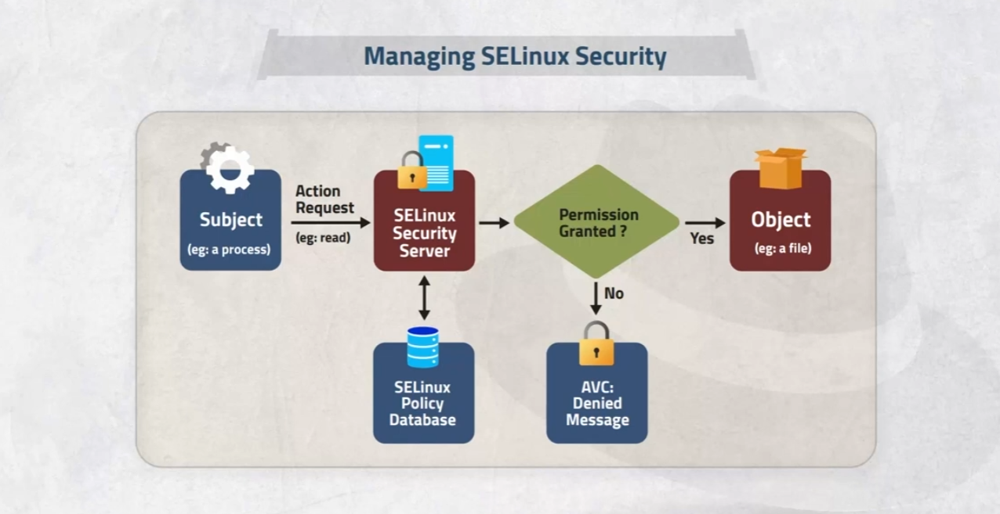
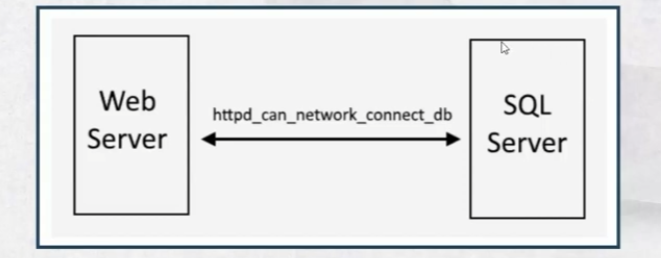

# CH01: Improving Command-Line Productivity 

improving command-line productivity in Red Hat Enterprise Linux (RHEL) by providing a comprehensive, practical, and beginner-friendly approach to Bash shell scripting. It focuses on automating tasks, using loops and conditionals, and processing text with `grep` and regular expressions, tailored for your CentOS 9 VMs (`slave1`, `slave2`, `slave3` at `192.168.64.131–133`). The guide includes advanced scripting techniques, troubleshooting tips, and integration with your Ansible setup for MySQL management, ensuring relevance for system administration tasks.

## 1. Introduction to Shell Scripting

Bash shell scripting in RHEL and CentOS enables system administrators to automate repetitive tasks, streamline workflows, and enhance command-line efficiency. Scripts are text files containing sequences of commands, executed by the Bash interpreter, saving time compared to manual command entry. This guide is particularly relevant for your environment, where scripts can automate MySQL backups on `slave3` or log analysis across VMs.

### Why Shell Scripting?
- **Automation**: Scripts execute multiple commands in sequence, reducing manual effort (e.g., backing up `/var/lib/mysql`).
- **System Integration**: Used in RHEL boot processes (e.g., `/etc/rc.d`) and system administration tasks.
- **Simplicity**: Bash syntax mirrors command-line utilities, making it accessible for beginners.
- **Flexibility**: Ideal for file manipulation, log processing, and system monitoring.

### When to Avoid Shell Scripts
Shell scripts are less suitable for:
- Resource-intensive tasks (e.g., sorting large datasets).
- Complex mathematical operations.
- Multi-dimensional arrays or GUI applications.
- Direct hardware access or legacy code integration.

For these, consider Python, Perl, or C/C++.

## 2. Writing Effective Bash Scripts

### Shebang (`#!`)
The shebang specifies the script’s interpreter. For Bash, use:
```bash
#!/bin/bash
```
Without a shebang, the system defaults to the user’s shell (usually Bash).

### Making Scripts Executable
Make a script executable:
```bash
chmod +x script.sh
./script.sh
```
Alternatively, run with:
```bash
bash script.sh
```

### Best Practices
- **Comments**: Use `#` to explain code:
  ```bash
  # Backup MySQL data on slave3
  ```
- **Exit on errors**: Use `set -e` to stop on command failures:
  ```bash
  set -e
  ```
- **Check variables**: Use `set -u` to exit on undeclared variables:
  ```bash
  set -u
  ```
- **Quote variables**: Use double quotes to handle spaces:
  ```bash
  echo "$VAR"
  ```
- **Use functions**: Organize code for reusability:
  ```bash
  backup_mysql() {
      tar -czf mysql_backup.tar.gz /var/lib/mysql
  }
  ```
- **Debugging**: Use `bash -x script.sh` to trace execution.
- **Descriptive names**: Use clear names like `mysql_backup.sh`.

## 3. Basic Scripting Constructs

### Output and Variables
- **Print output**: Use `echo`:
  ```bash
  echo "Starting MySQL backup"
  ```
- **Capture command output**: Use `$(command)` or backticks:
  ```bash
  HOST=$(hostname -s)
  echo "Hostname: $HOST"
  ```

### Quoting Special Characters
- **Backslash (`\`)**: Escapes one character:
  ```bash
  echo \$HOST  # Outputs: $HOST
  ```
- **Single quotes (`'`)**: Treats content literally:
  ```bash
  echo '$HOST'  # Outputs: $HOST
  ```
- **Double quotes (`"`)**: Expands variables:
  ```bash
  echo "$HOST"  # Outputs: server01
  ```

### File and Directory Handling
Quote names with spaces:
```bash
touch "mysql log.txt"
cd "mysql logs"
```

### Special Characters
| **Character** | **Description** |
|---------------|-----------------|
| `.`           | Hidden files, current directory (`.`), or parent directory (`..`) |
| `*`           | Wildcard for filename expansion |
| `$`           | Variable reference or regex end-of-line |

### Brace Expansion
Generate sequences:
```bash
touch {log1,log2,log3}.txt
echo {1..5}  # Outputs: 1 2 3 4 5
```

### Redirection and Pipes
- **Redirect output**: `>` overwrites, `>>` appends:
  ```bash
  ls > files.txt
  ```
- **Pipe output**: `|` sends output to another command:
  ```bash
  ls | grep ".log"
  ```

## 4. Loops for Efficient Command Execution

Loops iterate over lists or conditions, automating repetitive tasks.

### `for` Loop
Iterate over a list:
```bash
for file in *.log; do
    echo "Processing $file"
done
```
Example: Rename MySQL logs on `slave3`:
```bash
for file in /var/log/mysql*.log; do
    mv "$file" "backup_$file"
    echo "Renamed $file"
done
```

### `while` Loop
Run while a condition is true:
```bash
i=1
while [ $i -le 5 ]; do
    echo "Count: $i"
    ((i++))
done
```

### `until` Loop
Run until a condition is true:
```bash
i=1
until [ $i -gt 5 ]; do
    echo "Count: $i"
    ((i++))
done
```

## 5. Conditional Statements

Conditionals control script flow based on conditions.

### `if/then` Construct
Check command exit status:
```bash
if [ -d /var/lib/mysql ]; then
    echo "MySQL directory exists"
else
    echo "MySQL directory missing"
fi
```

### `if/elif/else` Construct
Handle multiple conditions:
```bash
x=5
if [ $x -gt 10 ]; then
    echo "x is large"
elif [ $x -gt 5 ]; then
    echo "x is medium"
else
    echo "x is small"
fi
```

### Testing with `[[...]]`
Use `[[...]]` for string and file tests:
```bash
[[ -f /var/log/mysqld.log ]] && echo "MySQL log exists"
```

## 6. Regular Expressions and `grep`

Regular expressions (regex) match patterns in text, crucial for log analysis.

### Regex Symbols
| **Symbol** | **Description** |
|------------|-----------------|
| `.`        | Any single character |
| `^`        | Start of line |
| `$`        | End of line |
| `*`        | Zero or more of previous |
| `[]`       | Any one of enclosed characters |
| `|`        | OR operator |
| `\`        | Escape special characters |

### Using `grep`
Search logs on `slave3`:
- **Find errors**: `grep "ERROR" /var/log/mysqld.log`
- **Match start of line**: `grep "^ERROR" /var/log/mysqld.log`
- **Match digits**: `grep "[0-9]" /var/log/mysqld.log`

## 7. Practical Example: MySQL Backup Script

This script automates MySQL backups on `slave3` and transfers them to `slave1`:
```bash
#!/bin/bash
set -e
set -u

BACKUP_DIR="/tmp/backups"
REMOTE_HOST="osboxes@192.168.64.131"
REMOTE_PATH="/home/osboxes/backups"

# Create backup directory
mkdir -p "$BACKUP_DIR"

# Archive MySQL data
for dir in /var/lib/mysql /var/log; do
    if [ -d "$dir" ]; then
        tar -czf "$BACKUP_DIR/$(basename "$dir")_$(date +%F).tar.gz" "$dir"
        if [ $? -eq 0 ]; then
            echo "Archived $dir successfully"
        else
            echo "Failed to archive $dir"
            exit 1
        fi
    else
        echo "$dir does not exist"
    fi
done

# Transfer backups
for file in "$BACKUP_DIR"/*.tar.gz; do
    scp "$file" "$REMOTE_HOST:$REMOTE_PATH"
    if [ $? -eq 0 ]; then
        echo "Transferred $file to $REMOTE_HOST"
    else
        echo "Failed to transfer $file"
        exit 1
    fi
done
```

## 8. Troubleshooting Common Issues

| **Issue** | **Cause** | **Solution** |
|-----------|-----------|--------------|
| `Permission denied` | Script not executable | `chmod +x script.sh` |
| `Command not found` | Missing shebang | Add `#!/bin/bash` |
| `Variable unset` | Undeclared variable | Use `set -u` or check variables |
| `grep no matches` | Incorrect regex | Test regex with `echo "test" | grep "pattern"` |

## 9. Integration with Ansible
Scripts can complement your Ansible playbooks:
```yaml
- name: Run MySQL backup script
  hosts: db
  tasks:
    - name: Copy backup script
      copy:
        src: mysql_backup.sh
        dest: /home/osboxes/mysql_backup.sh
        mode: '0755'
    - name: Execute backup script
      command: /home/osboxes/mysql_backup.sh
```

## 10. Summary
This guide covers Bash scripting for automating tasks, using loops and conditionals, and processing text with `grep`. It’s tailored for your CentOS 9 environment, enhancing productivity for MySQL management and log analysis.


### Key Citations
- [Red Hat Enterprise Linux 9 Documentation](https://docs.redhat.com/en/documentation/red_hat_enterprise_linux/9)
- [GeeksforGeeks: Bash Scripting](https://www.geeksforgeeks.org/bash-scripting/)


# CH02: Scheduling Future Tasks

## Scheduling One-Time Tasks with the "at" Command

### Goal
- Schedule tasks to automatically execute in the future.

### Objectives
- Set up a command that runs once at a specific point in the future.
- Schedule commands to run on a repeating schedule using a user's crontab file.
- Schedule commands to run on a repeating schedule using the system crontab file and directories.
- Enable and disable `systemd` timers, and configure a timer that manages temporary files.

---

### Scheduling One-Time Tasks with the `at` Command

- Use the `at TIMESPEC` command to schedule a new job. The `at` command reads the commands to execute from the stdin channel.
- When manually entering commands, finish your input by pressing `Ctrl+D`.
- For more complex commands, it's easier to use input redirection from a script file. For example:
  ```bash
  at now + 5min < myscript
  ```
  This method avoids typing all the commands manually in the terminal.

### TIMESPEC Argument in the `at` Command
- The `TIMESPEC` argument accepts powerful combinations to describe exactly when a job should run.
- Typically, it starts with a time (e.g., `02:00pm`, `15:59`, or even `teatime`), followed by an optional date or number of days in the future.

#### Examples of TIMESPEC Combinations:
- `now + 5min`
- `teatime tomorrow` (teatime is 16:00)
- `noon + 4 days`
- `5pm August 3 2021`

### Inspecting and Managing Deferred User Jobs
- To view pending jobs for the current user, use the `atq` command (or `at -i`).
  ```bash
  atq
  ```
  This lists the user's pending jobs. If the user is a superuser, it lists everybody's jobs.
  
  Format of output:
  ```
  Job number, date, hour, queue, username.
  ```

  Example:
  ```
  28 Mon Feb 2 05:13:00 2015 a user
  29 Mon Feb 3 16:00:00 2014 h user
  ```

#### Managing Jobs
- To delete a scheduled job, use the `atrm` command followed by the job number:
  ```bash
  atrm <job number>
  ```

---

## Creating and Managing "at" Jobs

### Basic Steps to Schedule an "at" Task
1. Use the `systemctl` command to check if the `atd` service is running:
   ```bash
   systemctl status atd
   ```
2. To create an "at" task, specify the time and command:
   ```bash
   at noon
   at> echo "Hello" >> /tmp/hello.txt
   Ctrl+D to save and exit
   ```
3. You can use a variety of time formats such as:
   - `now`
   - `1hour`
   - `6AM`
   - `tomorrow`
   - `4PM + 3days`
   - `10AM Jul 31`
   - `teatime`

### Viewing and Managing Jobs
- View scheduled jobs:
  ```bash
  atq
  ```
- Display job script:
  ```bash
  at -c <jobid>
  ```

### Important Files for "at" Jobs
- `/etc/at.allow`: Users listed here can use `at` commands.
- `/etc/at.deny`: Users listed here are denied from using `at`.
- `/var/spool/at/`: Contains the job scripts.

**Notes**:
- If both `at.allow` and `at.deny` files do not exist, all users are denied access to `at`.
- By default, the installation creates `at.deny`, allowing all users to use `at`.

---

## Recurring Jobs with Crontab

### Overview
- Recurring jobs execute tasks on a repeating schedule.
- The `crond` daemon (provided by the `cronie` package) manages recurring jobs. The `crond` daemon reads configuration files that define when and what tasks to run.
  
### Crontab Syntax
- Fields in the crontab file appear in the following order:
  - Minutes (0-59)
  - Hours (0-23)
  - Day of month (1-31)
  - Month (1-12 or Jan, Feb, etc.)
  - Day of week (0-6 or Sun, Mon, etc.)

### Basic Crontab Commands
- Create or edit a crontab for the current user:
  ```bash
  crontab -e
  ```
- List crontabs for the current user:
  ```bash
  crontab -l
  ```
- Remove all jobs for the current user:
  ```bash
  crontab -r
  ```

#### Example Crontab Job
- Run a backup script every Monday at 8:00 PM:
  ```bash
  0 20 * * 1 /root/Desktop/backup.sh
  ```

### Crontab File Locations
- `/etc/cron.d`: Place cron jobs here.
- `/etc/cron.deny`: Users listed here are denied from creating cron jobs.
- `/etc/cron.allow`: Users listed here are allowed to create cron jobs.
- `/var/spool/cron/`: Contains all user crontabs.
- `/etc/crontab`: Contains the system-wide crontab configuration.

---

## Managing Services with Systemd Timers

### Managing Temporary Files
- Some applications use `/tmp` for temporary data. Systemd manages temporary files with the `systemd-tmpfiles` tool.
- The command:
  ```bash
  systemd-tmpfiles --create --remove
  ```
  reads configuration files from:
  - `/usr/lib/tmpfiles.d/*.conf`
  - `/run/tmpfiles.d/*.conf`
  - `/etc/tmpfiles.d/*.conf`

#### Listing Systemd Timers
```bash
systemctl list-units --type=timer
```

#### Changing Timer Configuration
1. Copy the timer file:
   ```bash
   cp /usr/lib/systemd/system/sysstat-collect.timer /etc/systemd/system/sysstat-collect.timer
   ```
2. Edit the timer file:
   ```bash
   vi /etc/systemd/system/sysstat-collect.timer
   ```

3. After changes, reload the `systemd` configuration:
   ```bash
   systemctl daemon-reload
   ```

---

## Summary

- Deferred jobs are tasks scheduled to run once in the future.
- Recurring jobs are tasks that repeat on a regular schedule.
- `systemd` timers can execute both deferred and recurring jobs.

---

# CH03: Tuning System Performance

## Goal:
- Improve system performance by setting tuning parameters and adjusting the scheduling priority of processes.

## Objectives:
- Optimize system performance by selecting a tuning profile managed by the `tuned` daemon.
- Prioritize or de-prioritize specific processes using the `nice` and `renice` commands.

---

## Tuning the System

System administrators can optimize system performance by adjusting various device settings based on workload requirements. The `tuned` daemon applies tuning adjustments either statically or dynamically using tuning profiles designed for specific performance needs.

### Configuring Static Tuning:
- Static tuning involves predefined kernel parameters in profiles that are applied at runtime. 
- The parameters are set based on performance expectations and remain constant regardless of workload changes.

### Configuring Dynamic Tuning:
- Dynamic tuning, managed by the `tuned` daemon, continuously monitors system activity and adjusts settings dynamically based on real-time behavior. It starts with predefined settings in the chosen profile and adjusts them as necessary.

---

## Installing and Enabling Tuned

To install and enable the `tuned` package manually:
```bash
yum install tuned
systemctl enable --now tuned
```

---

## Selecting a Tuning Profile

The `tuned` application offers profiles divided into the following categories:
- **Power-saving profiles**: To save power.
- **Performance-boosting profiles**: To maximize performance. These include profiles focused on:
  - Low latency for storage and network
  - High throughput for storage and network
  - Virtual machine performance
  - Virtualization host performance

---

## Tuning Profiles Distributed with RHEL 9

| **Tuned Profile**           | **Purpose**                                                                 |
|-----------------------------|-----------------------------------------------------------------------------|
| `balanced`                  | Compromise between power saving and performance.                            |
| `desktop`                   | Faster response for interactive applications (derived from balanced).       |
| `throughput-performance`     | Maximum throughput for storage and network.                                |
| `latency-performance`        | Low latency for servers, sacrificing power consumption.                    |
| `network-latency`            | Adds low-latency tuning parameters to the latency-performance profile.      |
| `network-throughput`         | Focus on maximum network throughput, based on the throughput-performance profile. |
| `powersave`                  | Maximizes power savings.                                                   |
| `virtual-guest`              | Optimizes performance for virtual machines.                                |
| `virtual-host`               | Optimizes performance for virtualization hosts.                            |

---

## Managing Profiles with `tuned-adm`

The `tuned-adm` command is used to manage the `tuned` daemon. It can:
- Query current settings
- List available profiles
- Recommend a profile based on system characteristics
- Switch between profiles
- Deactivate tuning

### Examples:
1. **Check Active Profile**:
    ```bash
    tuned-adm active
    ```
    Example output:
    ```bash
    Current active profile: virtual-guest
    ```

2. **List Available Profiles**:
    ```bash
    tuned-adm list
    ```
    Example output:
    ```bash
    Available profiles:
    - balanced
    - desktop
    - latency-performance
    ```

3. **Switch Profiles**:
    ```bash
    tuned-adm profile throughput-performance
    tuned-adm active
    ```
    Example output:
    ```bash
    Current active profile: throughput-performance
    ```

4. **Get Profile Recommendation**:
    ```bash
    tuned-adm recommend
    ```
    Example output:
    ```bash
    virtual-guest
    ```

5. **Deactivate Tuning**:
    ```bash
    tuned-adm off
    tuned-adm active
    ```
    Example output:
    ```bash
    No current active profile.
    ```

---

## Creating Custom Tuning Profiles

Custom tuning profiles can be created to tailor performance for specific workloads.

### Example: Create a Web Server Profile
```bash
mkdir /usr/lib/tuned/web-server
cd /usr/lib/tuned/web-server
touch tuned.conf
vim tuned.conf
```

Contents of `tuned.conf`:
```
[main]
summary=Optimize for web server
include=throughput-performance

[script]
script=custom-script.sh
```

Create the custom script:
```bash
touch custom-script.sh
chmod +x custom-script.sh
vim custom-script.sh
```

Contents of `custom-script.sh`:
```bash
#!/bin/bash
echo "Custom tuned profile for web-server" >> /var/log/custom_script.log
```

Activate the profile:
```bash
tuned-adm list
tuned-adm profile web-server
tuned-adm active
```

Deactivate the profile:
```bash
tuned-adm off
systemctl disable --now tuned
```

---

## Linux Process Scheduling and Multitasking

Linux handles process multitasking using a **time-slicing** technique. The **process scheduler** within the Linux kernel is responsible for switching between processes.

- Processes have 40 different levels of **niceness**, ranging from `-20` (highest priority) to `19` (lowest priority).
- Default nice level is `0`, inherited from the parent process.
- **Root users** can set negative nice levels, while **non-root users** can only set positive nice levels for processes they own.

### View Process Niceness:
```bash
ps axo user,pid,nice,command
ps axo --sort=nice
```

---

## Setting Process Priority Using `nice` and `renice`

1. **Start a Process with a Specific Niceness Level**:
   ```bash
   nice -n 10 vim text &
   ```

2. **Change the Niceness of a Running Process**:
   ```bash
   renice 19 9182  # Changes the nice value of process 9182 to 19
   ```

3. **Use `top` to Renice**:
   - Open `top`
   - Press `r` to renice a process.

---

## Summary

- **`tuned`** is a daemon used to optimize system performance using predefined or custom tuning profiles.
- **Linux process niceness** allows users to control the priority of processes to balance system resources.

---

<<<<<<< HEAD
 # CH04: Controlling Access to Files with ACLs
=======
# CH04: Controlling Access to Files with ACLs
>>>>>>> 0cc62acef8126efc964bc44b2282d7b8e2b0f07b

## Goal
- Interpret and set Access Control Lists (ACLs) on files to handle situations requiring complex user and group access permissions.

## Objectives
- Describe use cases for ACLs, identify files that have ACLs set, and interpret the effect of those ACLs.
- Set and remove ACLs on files and define default ACLs automatically set by a directory on newly created files.

---

## Access Control List (ACL)

Access Control Lists (ACLs) provide an additional flexible permission mechanism for the file system on a Linux system. They enhance traditional UNIX file permissions for files and folders. With ACLs, you can give permissions for any user or group with fine-grained access rights.

ACLs can be configured per user, per group, or via the effective rights mask. These permissions can then be applied to an individual user or group, similar to the `rwx` (Read, Write, Execute) permissions found in regular file or folder permissions.

### Check Kernel for ACL Support

To check if the file system and kernel support ACLs, use the following command:
```bash
grep -i acl /boot/config*
```
You should see output like this:
```bash
CONFIG_XFS_POSIX_ACL=y
CONFIG_BTRFS_FS_POSIX_ACL=y
```
If you see `N` instead of `Y`, the kernel does not support ACLs, and it may need to be recompiled.

---

## Viewing and Interpreting ACL Permissions

The `ls -l` command only outputs minimal ACL setting details:
```bash
ls -l reports.txt
```
Example output:
```bash
-rwxrw----+ 1 user operators 130 Mar 19 23:56 reports.txt
```
The plus sign (`+`) at the end of the permission string indicates that an extended ACL structure exists on this file.

To display ACL settings on a file, use the `getfacl` command:
```bash
getfacl reports.txt
```
Example output:
```bash
# file: reports.txt
# owner: user
# group: operators
user::rwx
user:consultant3:---
user:1005:rwx         #effective:rw-
group::rwx            #effective:rw-
group:consultant1:r--
group:2210:rwx        #effective:rw-
mask::rw-
other::---
```

### Key Points:

1. **User Entries:**
   - `user::rwx`: The file owner (`user`) has `rwx` permissions.
   - `user:consultant3:---`: The user `consultant3` has no permissions.
   - `user:1005:rwx`: The user with UID `1005` has `rwx`, but the mask limits it to `rw-`.

2. **Group Entries:**
   - `group::rwx`: The group owner (`operators`) has `rwx`, but the mask limits it to `rw-`.
   - `group:consultant1:r--`: The group `consultant1` has `r` permissions only.
   - `group:2210:rwx`: The group with GID `2210` has `rwx`, but the mask limits it to `rw-`.

3. **Mask Entry:**
   - `mask::rw-`: The mask defines the maximum permissions possible for named users, the group owner, and named groups. The mask does not restrict the file owner's permissions.

4. **Other Entry:**
   - `other::---`: All other users and groups have no permissions.

---

## ACL Permission Precedence

- **ACL Mask:**
  - The ACL mask defines the maximum permissions that can be granted to named users, the group owner, and named groups. It does not affect the file owner's or the "other" entry's permissions. The mask can be set explicitly with `setfacl` or will be automatically added if not set.

- **Permission Precedence:**
  When determining file access:
  1. If the process is run by the file owner, the owner's ACL permissions apply.
  2. If the process is run by a user listed in a named user ACL entry, the named user ACL permissions apply (limited by the mask).
  3. If the process is run by a group that matches the group owner or a named group, the group ACL permissions apply (limited by the mask).
  4. If none of the above match, the "other" ACL permissions apply.

---

## Setting ACLs

Use the `setfacl` command to set or modify ACLs on any file or directory.

Examples:
```bash
setfacl -m u:karim:rw file.txt    # Set read and write for user karim
setfacl -m g:sales:rw dir1        # Set read and write for group sales
setfacl -R -m g:sales:rw dir1     # Apply recursively to dir1
setfacl -m u::rwx,g:consultants:rx,o::- file.txt    # Multiple entries in one command
```

You can use the output of `getfacl` as input for `setfacl` to copy ACL settings from one file to another:
```bash
getfacl file-A | setfacl --set-file=- file-B
```

---

## Backup and Restore ACLs

1. **Backup ACLs:**
   ```bash
   getfacl reports.txt > acl_backup.txt
   ```

2. **Restore ACLs:**
   ```bash
   setfacl --set-file=acl_backup.txt reports.txt
   ```

3. **Backup and Restore in One Command:**
   ```bash
   getfacl reports.txt | setfacl --set-file=- file2.txt
   ```

---

## Removing ACLs

To remove ACL permissions for a user or group, use the `-x` option. To remove all ACLs and reset to default permissions, use the `-b` option.

Examples:
```bash
setfacl -x u:karim file.txt       # Remove ACL for user karim
setfacl -b file.txt               # Roll back to default ACL
```

---

## Setting Default ACLs and Recursive Application

1. **Set default ACLs:**
   ```bash
   setfacl -m d:u:mohamed:rw- dir1    # Set default permissions for all files created inside dir1
   ```

2. **Apply ACLs recursively:**
   ```bash
   setfacl -R -m u:mohamed:rw dir2    # Apply permissions recursively to dir2
   ```

---

## Summary

- ACLs provide fine-grained access control to files and directories beyond traditional UNIX permissions.
- The `getfacl` command displays ACL settings.
- The `setfacl` command sets, modifies, and removes ACLs on files and directories.


# CH05: Managing SELinux Security

## Goal
Protect and manage the security of a server by using SELinux.

## Objectives
- Describe how SELinux protects resources and how to select the enforcement mode
- Configure a file's SELinux context to control how processes interact with that file
- Configure SELinux booleans to allow runtime policy changes for varying access needs
- Investigate SELinux log messages and troubleshoot SELinux AVC denials



## Why Use Security Enhanced Linux?

### Background
Security Enhanced Linux (SELinux) is an additional layer of system security with the primary goal of protecting user data from compromised system services.

### Key Differences from Traditional Security Model
- Traditional Model: Discretionary Access Control (user/group/other permissions)
- SELinux Model: Mandatory Access Control (object-based, more sophisticated rules)

### Security Risks Without SELinux
- Opening firewall ports for web servers can create exploitation opportunities
- Compromised web server processes gain full permissions of the web server user/group
- Potential unauthorized access to:
  - Document root (/var/www/html)
  - Temporary directories (/tmp, /var/tmp)
  - World-writable files and directories

## SELinux Contexts

### What is a Context?
- A special security label determining process access to files, directories, and ports
- Default policy: No interaction allowed without explicit rule
- Contexts include: user, role, type, and sensitivity
- Targeted policy (default in Red Hat Enterprise Linux) uses type context

### Context Naming Conventions
- Type context names usually end with `_t`
- Example context: `unconfined_u:object_r:httpd_sys_content_t:s0`
  - SELinux User
  - Role
  - Type
  - Level

### Example Contexts
- Web Server Process: `httpd_t`
- Web Server Files: `httpd_sys_content_t`
- Temporary Files: `tmp_t`
- Web Server Ports: `http_port_t`
- MariaDB Server: `mysqld_t`
- MariaDB Files: `mysqld_db_t`

### Useful Commands for Context Management
- Commands with `-Z` option for context display/setting:
  - `ps axZ`
  - `ps -ZC httpd`
  - `ls -Z /home`
  - `ls -Z /var/www`

## SELinux Modes

### 1. Enforcing Mode
- SELinux enforces policies
- Denies access to actions violating policies

### 2. Permissive Mode
- Logs policy violations
- Does not enforce policies
- Useful for testing and troubleshooting

### 3. Disabled Mode
- SELinux completely turned off
- No system security impact

### Mode Management Commands
- Check current mode: `getenforce`
- Check status: `sestatus`
- Change mode: `setenforce [enforcing | permissive]`
- Configuration file: `/etc/selinux/config`

## Initial SELinux Context

### Context Inheritance
- New files typically inherit context from parent directory
- Inheritance can be disrupted by:
  1. Creating file in one location, moving to another
  2. Copying files with preserved context

## Changing SELinux Context

### Recommended Methods
1. **semanage fcontext**: Declare default file labeling
2. **restorecon**: Apply context from parent
3. **chcon**: Temporary context changes (not recommended for permanent modifications)

### Context Change Commands
- `ls -lZ`: List files with contexts
- `chcon -t <context_type> <filename>`: Change context type
- `restorecon -v <filename>`: Restore default context

## Example Workflow
```bash
# Install Apache
dnf install httpd

# Enable web server
systemctl enable --now httpd

# Create file in web root
cd /var/www/html
touch index.html

# View contexts
ls -lZ index.html
ls -ldZ /var/www/html

# Move/Copy files (note context behavior)
mv file1 /var/www/html/ # maintain original content label
cp file2 /var/www/html/
cp -a file3 /var/www/html/ # maintain original content label


chcon -t httpd_sys_content_1file1

restorecon -v file3

ls -lz

#dir example

mkdir /virtual

ls -ldz /virtual
chcon -t httpd_sys_content_t:s0

restorecon -v /virtual # resture default context form data base
```


## SELinux: Managing Default File Context Rules, Ports, and Booleans

### Defining SELinux Default File Context Rules

#### Useful Commands for Managing File Contexts
| Command | Description |
|---------|-------------|
| `-a, --add` | Add a record of the specified object type |
| `-l, --list` | List records of the specified object type |
| `-d, --delete` | Delete a record of the specified object type |

#### Example: Ensuring Correct File Contexts for a Directory
```bash
semanage fcontext -l
restorecon -Rv /var/www/
```

#### Practical Example: Configuring SELinux for `/virtual`
```bash
semanage fcontext -a -t httpd_sys_content_t '/virtual(/.*)?'
semanage fcontext -l | grep -w /virtual
restorecon -Rv /virtual
```

#### Example: Configuring Apache to Use `/virtual`
```bash
mkdir /virtual
cd /virtual

semanage fcontext -a -t httpd_sys_content_t '/virtual(/.*)?'
semanage fcontext -l | grep -w /virtual
restorecon -Rv /virtual

vi /etc/httpd/conf/httpd.conf
# Modify:
# DocumentRoot "/var/www/html" --> DocumentRoot "/virtual"
# <Directory "/var/www/html"> --> <Directory "/virtual">

systemctl restart httpd

vi index.html  # Add content for the webpage
```

#### Deleting Context and Rolling Back Apache Configuration
```bash
semanage fcontext -d -t httpd_sys_content_t '/virtual(/.*)?'
semanage fcontext -l | grep -w /virtual
restorecon -Rv /virtual

vi /etc/httpd/conf/httpd.conf
# Rollback:
# DocumentRoot "/virtual" --> DocumentRoot "/var/www/html"
# <Directory "/virtual"> --> <Directory "/var/www/html">
```

---

### Changing the Default Port for `sshd`

#### Configuring SELinux for SSH Port Changes
1. Modify `/etc/ssh/sshd_config`:
    ```bash
    vi /etc/ssh/sshd_config
    # Change port:
    # Port 22 --> Port 9999
    ```

2. Restart `sshd`:
    ```bash
    systemctl restart sshd
    ```
   If it fails, check logs:
   ```bash
   journalctl -xeu sshd.service
   less -f /var/log/audit/audit.log
   ```

3. Update SELinux for the new port:
    ```bash
    semanage port -a -t ssh_port_t -p tcp 9999
    ```

4. Verify and troubleshoot:
    ```bash
    semanage port -l | grep ssh
    ```

5. Delete unused ports:
    ```bash
    semanage port -d -t ssh_port_t -p tcp 9999
    ```

---

### SELinux Booleans


#### Overview
- SELinux Booleans are switches that modify policy behavior.
- Use `getsebool` and `setsebool` commands to manage booleans.
- `setsebool -P` makes changes persistent across reboots.



#### Example: Managing Web Server Boolean
```bash
getsebool httpd_can_network_connect_db  # Check the state
setsebool httpd_can_network_connect_db on  # Enable the boolean
semanage boolean -l | grep httpd_can_network_connect_db  # Verify status
```

---

### Troubleshooting SELinux Issues

#### Installing `setroubleshoot-server` for Logs
```bash
rpm -qa | grep setroubleshoot-server  # Verify installation
yum install setroubleshoot-server    # Install if not present
```

#### Generating Reports
- Use `sealert` for detailed incident reports:
    ```bash
    sealert -a /var/log/audit/audit.log  # Analyze all incidents
    sealert -l <UUID>                   # Report for a specific UUID
    ```

#### Practical Example: Resolving Access Issues
```bash
touch myweb
ls -lZ myweb

mv myweb /var/www/html/
ls -lZ /var/www/html/

curl http://localhost/myweb  # If it fails:
tail /var/log/audit/audit.log
tail /var/log/messages

restorecon -v /var/www/html/myweb  # Fix the file context
```

---

## **Cockpit: A Web Interface for Linux Administration and SELinux Management**

**Cockpit** is a powerful web-based interface for managing Linux systems. It enables administrators to monitor resources, manage services, and troubleshoot SELinux and other system-related issues efficiently through a user-friendly interface.

---

### **Key Features of Cockpit**
1. **Real-Time System Monitoring**:
   - CPU, memory, disk, and network usage are displayed in real-time.
   - Interactive graphs for performance tracking.
2. **Service and Process Management**:
   - Start, stop, restart, enable, or disable services directly from the interface.
   - Manage running processes with tools to inspect or terminate them.
3. **SELinux Troubleshooting**:
   - View and analyze SELinux violations.
   - Modify file contexts, ports, and booleans with guided suggestions.
4. **Log Viewer**:
   - Access system logs for audit and error tracking.
   - Filter logs for SELinux-related errors or other specific events.
5. **User Management**:
   - Add, remove, or modify system users and permissions.
6. **Terminal Access**:
   - Integrated terminal for command-line operations within the browser.

---

### **Installation and Setup**

#### Install Cockpit:
1. Use the package manager to install:
   ```bash
   sudo yum install cockpit
   ```
2. Start and enable the Cockpit service:
   ```bash
   sudo systemctl start cockpit
   sudo systemctl enable cockpit
   ```
3. Open the firewall for Cockpit's web interface:
   ```bash
   sudo firewall-cmd --add-service=cockpit --permanent
   sudo firewall-cmd --reload
   ```

#### Access the Cockpit Web Interface:
1. Open a browser and navigate to:
   ```
   https://<your-server-ip>:9090
   ```
2. Log in with your system administrator credentials.

---

### **Using Cockpit for SELinux Management**

#### 1. **SELinux Troubleshooter**
   - Navigate to the **SELinux** module to review any reported policy violations.
   - The interface lists:
     - Denied actions.
     - Violated SELinux rules.
     - Suggested fixes with explanations.
   - Apply recommended fixes directly from Cockpit or copy the commands for CLI use.

#### 2. **File Context Management**
   - View and modify SELinux file contexts.
   - Add new context rules for files and directories, ensuring compatibility with SELinux policies.
   - Apply the changes using:
     ```bash
     restorecon -Rv <directory>
     ```

#### 3. **Port Management**
   - Display SELinux rules for active ports.
   - Add or delete allowed ports for services like HTTP (`http_port_t`) or SSH (`ssh_port_t`).
   - Example:
     ```bash
     semanage port -a -t http_port_t -p tcp 8080
     ```

#### 4. **Boolean Management**
   - View and toggle SELinux booleans to adjust service permissions dynamically.
   - Make changes persistent with the click of a button or the following command:
     ```bash
     setsebool -P <boolean_name> <on|off>
     ```

---

### **Example: Troubleshooting SELinux Issues with Cockpit**

1. **Analyzing SELinux Denials**:
   - Access the **Logs** section in Cockpit.
   - Look for AVC denial messages or use the search feature to filter SELinux-related events.
   - Copy the UUID of a specific denial.

2. **Viewing Recommendations**:
   - Open the **SELinux Troubleshooter**.
   - Enter the UUID to analyze the issue and see recommended fixes.
   - Example fixes might include modifying file contexts or adjusting SELinux booleans.

3. **Applying Fixes**:
   - Apply fixes directly through Cockpit or execute the commands manually:
     ```bash
     restorecon -v <file_or_directory>
     setsebool -P <boolean_name> <on|off>
     ```

---

### **Benefits of Using Cockpit for SELinux Management**

- **Ease of Use**: A graphical interface reduces the complexity of CLI commands.
- **Centralized Management**: Manage multiple aspects of the system from a single dashboard.
- **Time Efficiency**: Built-in recommendations and troubleshooting tips save time during debugging.
- **Accessibility**: Available via web browser without requiring additional software on the client side.

Cockpit is particularly useful for administrators managing SELinux policies and troubleshooting issues, offering an intuitive alternative to traditional command-line methods.

---


# CH06: Partitions and Filesystems in Linux

## Goal
Create and manage storage devices, partitions, file systems, and swap spaces from the command line.

## Objectives
- Create storage partitions, format them with file systems, and mount them for use.
- Create and manage swap spaces to supplement physical memory.

## What is a File System in Linux or Unix?
A file system is a structured collection of files and directories stored on a disk. It organizes data for efficient storage, retrieval, and management. Each file system is typically stored in a separate disk partition. Common Linux file systems include:
- **ext4**: A journaling file system with good performance and reliability.
- **XFS**: High-performance file system, default in Red Hat Enterprise Linux, suitable for large-scale storage.
- **Btrfs**: Supports snapshots, RAID, and data integrity features.
- **FAT32/NTFS**: For compatibility with Windows, though less efficient on Linux.

### Components of a File System
File systems are divided into two main categories:
- **User Data**: Stores the actual content of files (e.g., text, images, binaries).
- **Metadata**: Stores structural information about the file system, including:
  - Superblock
  - Inodes
  - Directories

Partitions are divided into blocks (smallest unit of storage, typically 512 bytes or 4KB), which include:
- **Superblock**: Metadata about the file system itself.
- **Data Blocks**: Where user data is stored.
- **Inode Blocks**: Metadata about individual files and directories.

## What is a Superblock?
The superblock is a critical metadata structure in a file system that contains essential information about the file system as a whole. Each file system type (e.g., ext2, ext3, ext4, XFS) has its own superblock format. Key details stored in the superblock include:
- File system type (e.g., ext4, XFS).
- Status (e.g., clean, mounted, or needs repair).
- Size of the file system (in blocks or bytes).
- Information about other metadata structures (e.g., inode count, block size).
- Mount status and timestamps.

If the superblock is corrupted, the file system may become inaccessible. Many file systems maintain backup copies of the superblock for recovery.

## What is an Inode?
An inode (index node) is a data structure that stores metadata about a file or directory (but not the file's name or actual data). Each file or directory has a unique inode. Key information in an inode includes:
- File type (e.g., regular file, directory, symbolic link, block device).
- Permissions (read, write, execute for owner, group, others).
- Owner (user ID) and Group (group ID).
- File size (in bytes).
- Timestamps: Access time (atime), modification time (mtime), change time (ctime).
- Number of hard links.
- Access Control Lists (ACLs) for advanced permissions.
- Pointers to data blocks where the actual file content is stored.

Inodes do not store the file name; that's handled by directory entries. The total number of inodes is fixed when the file system is created, limiting the maximum number of files.

## Adding Disks, Partitions, and File Systems to a Linux System
Linux supports flexible storage configurations. Common setups include:
1. **Direct File System on Disk**: A file system created directly on the entire disk (e.g., `/dev/sda`).
2. **File System on Partition**: A partition (e.g., `/dev/sda1`) on the disk, with a file system formatted on it.
3. **File System on Logical Volume**: Using Logical Volume Manager (LVM) for dynamic resizing, on top of partitions or disks.

This allows for scalability, such as combining multiple disks into logical volumes.

## Mounting File Systems
Mounting attaches a file system to a directory in the Linux directory tree, making its contents accessible. Without mounting, the file system exists but isn't part of the active file hierarchy.

- **Temporary Mounting**: Use the `mount` command for one-time use. Example:
  ```
  sudo mount /dev/sda1 /mnt/data
  ```
  This mounts `/dev/sda1` to `/mnt/data`. It lasts until unmounted or reboot.

- **Permanent Mounting**: To make mounts persist across reboots, add entries to `/etc/fstab` (File System Table). Format: `device mount_point file_system_type options dump pass`. Example:
  ```
  /dev/sda1   /mnt/data   ext4   defaults   0   2
  ```
  After editing, run `sudo systemctl daemon-reload` or reboot. Use `sudo mount -a` to mount all entries in `/etc/fstab`.

Unmount with `umount /mnt/data`. Always ensure no processes are using the mount point before unmounting.

## Partitioning a Disk
Disk partitioning divides a hard drive into logical storage units called partitions. This is useful for:
- Limiting space for applications or users (e.g., quotas).
- Separating OS/program files from user data (e.g., `/` vs `/home`).
- Creating dedicated swap areas for virtual memory.
- Improving performance of tools like backups or diagnostics by isolating data.

Partitions help organize data and enhance security/recovery.

## MBR Partitioning Scheme
The Master Boot Record (MBR) is a legacy partitioning scheme from 1982, also known as MSDOS partitioning. It stores boot loader code and the partition table in the first sector of the disk.

- **Limitations**:
  - Maximum 4 primary partitions.
  - With extended/logical partitions, up to 15 partitions total on Linux.
  - 32-bit addressing limits disk/partition size to 2 TiB (terabytes).
  - Single point of failure: If the MBR is corrupted, the disk may become unbootable.

- **Structure Example** (on `/dev/vdb`):
  - Primary partitions: `/dev/vdb1`, `/dev/vdb2`, `/dev/vdb3`.
  - Extended partition: `/dev/vdb4` (container for logical partitions like `/dev/vdb5`, `/dev/vdb6`).

MBR is being replaced by GPT due to size limits and lack of redundancy.

### Primary, Extended, and Logical Partition Types
- **Primary Partition**: Standard partitions created by default. Use if ≤4 partitions are needed. Data can be stored directly.
- **Extended Partition**: A container for additional partitions if >4 are required. Only one per disk. Cannot store data directly; acts as a "wrapper" for logical partitions.
- **Logical Partition**: Partitions inside an extended partition. Treated like primary partitions by the OS. No limit beyond disk space.

Example layouts:
- **4 Primaries Only**: Primary1 | Primary2 | Primary3 | Primary4
- **With Extended**: Primary1 | Primary2 | Primary3 | Extended (Logical1 | Logical2 | ...)

## GPT Partitioning Scheme
GUID Partition Table (GPT) is the modern standard, using Globally Unique Identifiers (GUIDs) for disks and partitions.

- **Advantages**:
  - Up to 128 partitions by default.
  - 64-bit addressing supports disks/partitions up to 8 ZiB (zettabytes, or ~9.4e21 bytes).
  - Redundancy: Primary GPT at disk start, backup at end. Uses checksums for error detection.
  - Required for UEFI booting and disks >2 TiB.

- **Structure Example** (on `/dev/vdb`):
  - Partitions: `/dev/vdb1` to `/dev/vdb128`.
  - Primary GPT | Partitions | Backup GPT | Unused space.

### Should I Use MBR or GPT in Linux?
- **MBR**: Use for legacy systems, BIOS booting, or small disks (<2 TiB). Risky due to single-point failure.
- **GPT**: Preferred for modern systems. Stores multiple copies of partitioning/boot data across the disk for better corruption recovery. Supports larger disks and is more robust.

## Managing Partitions with Parted
`parted` is a command-line tool for creating, deleting, and modifying partitions on MBR or GPT disks. It applies changes immediately, so use cautiously to avoid data loss.

- **Basic Usage**:
  ```
  sudo parted /dev/vda print  # Display partition table
  ```
  - Interactive mode: `sudo parted /dev/vda` (then enter commands like `print`).
  - Units: Change with `unit s` (sectors), `unit B` (bytes), `unit MB`, etc. Default: powers of 10 (MB, GB).

### Writing the Partition Table on a New Disk
First, set the disk label (scheme):
- MBR: `sudo parted /dev/vda mklabel msdos`
- GPT: `sudo parted /dev/vda mklabel gpt`

This wipes existing data—use only on new or repurposed disks.

### Creating MBR Partitions
Interactive:
1. `sudo parted /dev/vdb`
2. `(parted) mkpart`
3. Partition type? `primary` (or `extended` for >4 partitions).
4. File system type? `xfs` (indicative only; doesn't format).
5. Start? `2048s` (sector; 1 sector = 512 bytes).
6. End? `1000MB`
7. `(parted) quit`
8. `sudo udevadm settle` (detect new device files).

Non-interactive: `sudo parted /dev/vdb mkpart primary xfs 2048s 1000MB`

For >4 partitions: Create 3 primaries + 1 extended, then logicals inside extended.

### Creating GPT Partitions
Similar to MBR, but add a partition name:
1. `sudo parted /dev/vdb`
2. `(parted) mkpart`
3. Partition name? `usersdata`
4. File system type? `xfs`
5. Start? `2048s`
6. End? `1000MB`
7. `(parted) quit`
8. `sudo udevadm settle`

Non-interactive: `sudo parted /dev/vdb mkpart usersdata xfs 2048s 1000MB`

### Deleting Partitions
1. `sudo parted /dev/vdb`
2. `(parted) print` (identify partition number).
3. `(parted) rm 1` (deletes immediately).
4. `(parted) quit`

## Useful Commands for Partitions
- `lsblk`: List block devices. Options: `-p` (full paths), `-f` (file systems).
- `fdisk`: For MBR (or GPT in modern versions). Interactive: `sudo fdisk /dev/sda` (commands: p=print, n=new, d=delete, w=write).
- `gdisk`: For GPT. Interactive: `sudo gdisk /dev/sda` (similar commands; r for MBR-to-GPT conversion).

## Creating File Systems
After partitioning, format with a file system:
- XFS (default in RHEL): `sudo mkfs.xfs /dev/vdb1`
- ext4: `sudo mkfs.ext4 /dev/vdb1`

## Managing Swap Space
Swap space extends RAM by using disk space for inactive data, preventing out-of-memory issues but slowing performance (disk << RAM speed).

### Introducing Swap Space Concepts
- **Virtual Memory**: RAM + Swap.
- Kernel swaps idle pages from RAM to disk when RAM is low.
- Not a substitute for sufficient RAM—use for bursts or hibernation.

### Creating a Swap Partition
1. Create partition: `sudo parted /dev/vdb mkpart swap linux-swap 1001MB 2000MB`
2. Format: `sudo mkswap /dev/vdb2`
3. Activate: `sudo swapon /dev/vdb2`
4. Persist: Add to `/etc/fstab` (e.g., `/dev/vdb2 swap swap defaults 0 0`), then `sudo systemctl daemon-reload`.

### Creating a Swap File
1. Allocate: `sudo fallocate -l 1G /swap_file` (or `dd if=/dev/zero of=/swap_file bs=1M count=1024`).
2. Format: `sudo mkswap /swap_file`
3. Activate: `sudo swapon /swap_file`
4. Persist: Add to `/etc/fstab` (e.g., `/swap_file swap swap defaults 0 0`).

- Activate all in fstab: `sudo swapon -a`
- View usage: `free -m` or `swapon --show`
- Deactivate: `sudo swapoff /swap_file`

### Setting Swap Space Priority
In `/etc/fstab`, use `pri=N` (higher = used first; default -2). Equal priorities: round-robin.
Example `/etc/fstab`:
```
/dev/swap1 swap swap defaults 0 0
/dev/swap2 swap swap pri=4 0 0
/dev/swap3 swap swap pri=10 0 0
```
Kernel uses pri=10 first.

## Summary
- Use `parted` for MBR/GPT partitioning.
- Format with `mkfs.xfs` or `mkfs.ext4`.
- Mount temporarily with `mount`; persist via `/etc/fstab`.
- Manage swap with `mkswap`, `swapon`, and priorities for efficient virtual memory.

This guide provides a comprehensive, hands-on approach to Linux storage management. Always back up data before partitioning!

---

# CH07: Managing Logical Volumes
# Managing Logical Volumes in Linux

## Goal
Create and manage logical volumes containing file systems and swap spaces from the command line.

## Objectives
- Create and manage logical volumes from storage devices, format them with file systems, or prepare them with swap spaces.
- Add and remove storage assigned to volume groups.
- Nondestructively extend the size of a logical volume formatted with a file system.

## Managing Logical Volume Management (LVM) Storage
Logical Volume Management (LVM) is a flexible storage management system in Linux that abstracts physical storage devices into logical pools. This allows for dynamic resizing, snapshots, and easier disk management without downtime in many cases.

### LVM Structure Overview
Here's a conceptual diagram of an LVM setup:

```
File Systems:     /var (50 GB, ext4)          /home (190 GB, xfs)

Logical Volumes:  /dev/myvg/var              /dev/myvg/home

Volume Group:     myvg (240 GB total)

Physical Volumes: /dev/sda (120 GB)          /dev/sdb (120 GB)
```

LVM layers storage as follows:
- **Physical Volumes (PVs)**: Base layer, initialized from disks or partitions.
- **Volume Groups (VGs)**: Pools of PVs, acting like a single large disk.
- **Logical Volumes (LVs)**: Slices of VGs, where file systems or swap spaces are created.
- **File Systems/Swap**: Top layer for data storage or virtual memory.

## Logical Volume Management (LVM) Concepts
LVM simplifies disk space management by allowing dynamic allocation and resizing. For example:
- If a file system on an LV needs more space, allocate free extents from the VG and resize the file system online.
- If a disk fails, migrate data to a new PV in the same VG without interrupting services.

### LVM Definitions
- **Physical Devices**: Block devices (e.g., `/dev/sda`, disk partitions, RAID arrays, or SAN LUNs) used for storage. They must be initialized as PVs to join LVM.
- **Physical Volumes (PVs)**: Initialized physical devices divided into **Physical Extents (PEs)**—small, fixed-size chunks (default 4 MiB). PEs are the building blocks for higher layers.
- **Volume Groups (VGs)**: Storage pools combining one or more PVs. Equivalent to a whole disk in basic partitioning. A PV belongs to only one VG; VGs can have free space for new LVs.
- **Logical Volumes (LVs)**: Created from free PEs in a VG, providing usable "devices" (e.g., `/dev/myvg/mylv`). LVs consist of **Logical Extents (LEs)**, which map to PEs (1:1 by default, but can be mirrored or striped).

## Why Use Logical Volume Management (LVM)?
LVM offers significant advantages over traditional partitioning:
- **Spans Multiple Disks**: LVs can combine space from several physical disks seamlessly.
- **Easy Resizing**: Extend or (in some cases) shrink volumes without unmounting (no downtime for extensions).
- **Disk Replacement**: Migrate data from failing disks to new ones online.
- **Advanced Features**: Supports snapshots for backups, striping for performance, mirroring for redundancy.
- **Flexibility**: Easily add/remove volumes or storage; up to 256 LVs per VG (configurable).
- **Scalability**: Handles large setups, common in enterprise environments like servers or cloud storage.

### LVM Architecture Diagram (ASCII Art)
```
+------------------------+
| sda1    sdb1    sdc1   |
|  |       |       |     |
|  PV      PV      PV    |
|  |       |       |     |
|     Volume Group       |
|  |       |       |     |
| LV1     LV2     LV3    |
+------------------------+
```
- PVs aggregate into a VG.
- LVs are carved from the VG's pool.

## Creating LVM Components
LVM creation builds from the bottom up: PV → VG → LV → File System/Swap.

### 1. Create Physical Volumes (PVs)
Use `pvcreate` to initialize devices as PVs. This divides the device into PEs.
```
sudo pvcreate /dev/vdb1 /dev/vdb2
```
- Labels multiple devices at once.
- **Warning**: This overwrites existing data—back up first!
- View PVs: `pvs` (list) or `pvdisplay` (details).

### 2. Create a Volume Group (VG)
Use `vgcreate` to pool PVs into a VG.
```
sudo vgcreate vg01 /dev/vdb1 /dev/vdb2
```
- Creates `vg01` with combined space from the PVs.
- Create additional VGs for organization if needed.
- View VGs: `vgs` (list) or `vgdisplay` (details).

### 3. Create a Logical Volume (LV)
Use `lvcreate` to allocate space from a VG.
```
sudo lvcreate -n lv01 -L 700M vg01
```
- `-n`: Name the LV.
- `-L`: Size in bytes (e.g., 700M for MiB, 1G for GiB).
- `-l`: Size in extents (e.g., `-l 128` for 128 PEs).
- Size rounds to PE multiples if not exact.
- View LVs: `lvs` (list) or `lvdisplay` (details).

### 4. Add a File System or Swap
Format the LV:
- For XFS (common in RHEL): `sudo mkfs.xfs /dev/vg01/lv01`
- For ext4: `sudo mkfs.ext4 /dev/vg01/lv01`
- For Swap: `sudo mkswap /dev/vg01/lv01` then `sudo swapon /dev/vg01/lv01`

Mount persistently:
```
sudo mkdir /mnt/data
```
Add to `/etc/fstab`:
```
/dev/vg01/lv01   /mnt/data   xfs   defaults   0 0
```
Then:
```
sudo mount /mnt/data
```
- For swap in fstab: `/dev/vg01/lv01 swap swap defaults 0 0`
- Reload systemd: `sudo systemctl daemon-reload`

## Removing LVM Components
Removal is top-down: Unmount File System → Remove LV → Remove VG → Remove PV. This destroys data—back up first!

### Steps to Remove
1. **Prepare the File System**: Unmount.
   ```
   sudo umount /mnt/data
   ```
2. **Remove the Logical Volume**:
   ```
   sudo lvremove /dev/vg01/lv01
   ```
3. **Remove the Volume Group**:
   ```
   sudo vgremove vg01
   ```
4. **Remove the Physical Volumes**:
   ```
   sudo pvremove /dev/vdb1 /dev/vdb2
   ```

**Note**: Creation order: PV → VG → LV → File System. Removal: Reverse order to avoid dependencies.

## LVM Management Commands Summary
### Viewing Commands
- `pvs`: List physical volumes.
- `pvdisplay`: Detailed PV info.
- `vgs`: List volume groups.
- `vgdisplay`: Detailed VG info.
- `lvs`: List logical volumes.
- `lvdisplay`: Detailed LV info.

### Extending Logical Volumes (Online, No Downtime)
Extending an LV allows you to increase its size without interrupting services, provided there is free space in the VG. This is useful for growing file systems as data needs expand. The process can be done online for most file systems like XFS and ext4.

#### Steps to Extend:
1. **Check Available Space**: Ensure the VG has free extents.
   ```
   sudo vgdisplay data-vg | grep "Free PE"
   ```
   If no free space, add a new PV:
   ```
   sudo pvcreate /dev/sde1
   sudo vgextend data-vg /dev/sde1
   ```
   - This adds the new device to the VG, increasing its total capacity.

2. **Extend the Logical Volume**: Use `lvextend` to increase the LV size.
   ```
   sudo lvextend -L +3G /dev/data-vg/data-lv
   ```
   - `-L +3G`: Adds 3 GiB to the current size. Use absolute size with `-L 10G` to set to exactly 10 GiB.
   - If the LV is on a partition that needs resizing first (e.g., in a VM), use tools like `fdisk` or `growpart` to expand the underlying partition, then `pvresize` to update the PV.

3. **Resize the File System**: Update the file system to use the new space.
   - For XFS: `sudo xfs_growfs /dev/data-vg/data-lv`
   - For ext4: `sudo resize2fs /dev/data-vg/data-lv`
   - This step can be done while the file system is mounted.

4. **Combined Command (Recommended)**: Use `-r` to extend the LV and resize the FS in one step.
   ```
   sudo lvextend -r -L +3G /dev/data-vg/data-lv
   ```
   - Automatically handles the file system resize for supported types (ext2/3/4, XFS).

#### Best Practices for Extending:
- Always verify with `df -h` or `lsblk` after resizing to confirm the new size.
- In virtual environments, expand the virtual disk first, then resize the partition/PV/VG/LV/FS from outermost to innermost.
- No downtime required for extensions.

### Shrinking Logical Volumes (Requires Downtime, High Risk)
Shrinking reduces the size of an LV, but it's riskier than extending and can lead to data loss if not done correctly. Always back up data first. Not all file systems support shrinking (e.g., XFS does not). Shrinking requires unmounting the file system and is typically done to free space for other uses or to remove excess capacity.

#### Steps to Shrink (for ext4; XFS not supported):
1. **Backup Data**: Essential—shrinking is destructive if mishandled.

2. **Unmount the File System**:
   ```
   sudo umount /data
   ```

3. **Check the File System**: Ensure integrity.
   ```
   sudo e2fsck -f /dev/data-vg/data-lv
   ```

4. **Shrink the File System First**: Reduce the FS size before the LV.
   ```
   sudo resize2fs /dev/data-vg/data-lv 100M
   ```
   - Set to the new desired size (e.g., 100M). Must be smaller than current but larger than used space.

5. **Shrink the Logical Volume**:
   ```
   sudo lvreduce -L 100M /dev/data-vg/data-lv
   ```
   - `-L 100M`: Sets to exactly 100 MiB. Use `-L -900M` to reduce by 900 MiB.
   - The new LV size must be larger than or equal to the FS size.

6. **Remount the File System**:
   ```
   sudo mount /dev/data-vg/data-lv /data
   ```

7. **Combined Command (Recommended for Safety)**: Use `-r` to shrink FS and LV together.
   ```
   sudo lvreduce -r -L 100M /dev/data-vg/data-lv
   ```
   - Automatically shrinks the FS first, then the LV. Supported for ext2/3/4.

#### Shrinking a Volume Group or Physical Volume:
- To free a PV: Use `pvmove` to migrate data off it, then `vgreduce data-vg /dev/sde1` to remove it from the VG.
- Shrink PV: If unallocated space exists, use `pvresize --setphysicalvolumesize 40G /dev/sda1`.
- For single-disk setups, shrink from innermost (FS → LV → VG → PV → Partition).

#### Warnings for Shrinking:
- **XFS Limitation**: Shrinking is unsupported; attempts fail with errors like "Xfs filesystem shrinking is unsupported."
- Always shrink FS before LV to prevent corruption.
- Check used space with `df -h` before shrinking—new size must exceed used data.
- Not recommended for root LV without a live CD/rescue mode.
- Test in a VM first; data loss is common if steps are skipped.

## Additional Tips and Best Practices
- **Snapshots**: Use `lvcreate -s` for point-in-time copies (e.g., for backups).
- **Striping/Mirroring**: Specify with `lvcreate` options like `-i` (stripes) or `-m` (mirrors) for performance/redundancy.
- **Monitoring**: Use `lvmdiskscan` or `pvscan` to detect devices; `vgscan`/`lvscan` for scanning.
- **Common Pitfalls**: Ensure enough free PEs in VG before creating/extending LVs. Use `vgdisplay` to check free space.
- **Modern Usage**: In RHEL/CentOS, LVM is default for root partitions. For cloud/VMs, LVM aids in dynamic storage.


---

# CH08: Implementing Advanced Storage Features
# CH08: Implementing Advanced Storage Features in Linux

## Goal
Manage storage using the Stratis local storage management system and optimize storage space with Virtual Data Optimizer (VDO) volumes through compression and deduplication.

## Objectives
- Manage multiple storage layers using Stratis local storage management.
- Optimize storage space using VDO for compression and deduplication.

## Stratis vs. LVM
Both Stratis and LVM are advanced storage management solutions, but they serve different purposes and offer distinct features:

| Feature                     | Stratis                              | LVM                                  |
|-----------------------------|--------------------------------------|--------------------------------------|
| **Purpose**                 | Simplifies storage management with automated features | Flexible, manual control for complex storage setups |
| **Ease of Use**             | User-friendly, abstracts complexity | Requires manual configuration of PVs, VGs, LVs |
| **Snapshots**               | Thin-provisioned, independent snapshots | Snapshots consume space, tied to original LV |
| **File System Support**     | XFS only                             | ext4, XFS, and others               |
| **Advanced Features**       | Auto-tiering, pooling, encryption | Striping, mirroring, resizing       |
| **Management**              | `stratis` CLI, managed by `stratisd` daemon | `lvm` commands (e.g., `pvcreate`, `lvcreate`) |
| **Use Case**                | Modern, automated environments (e.g., cloud) | Enterprise, custom storage needs    |

**Stratis Architecture Example**:
```
-----------------------------------------------------------------
| filesystem1   filesystem2     filesystem3     filesystem4     |
|      ^              ^               ^                ^         |
|      |              |               |                |         |
|-------------------------         -----------------------       |
|        Pool1           |         |       Pool2          |      |
|-------------------------         -----------------------       |
|     ^        ^        ^            ^         ^        ^        |
|     |        |        |            |         |        |        |
| /dev/sda  /dev/sdb  /dev/sdc    /dev/sdd  /dev/sde  /dev/sdf   |
-----------------------------------------------------------------
```
- **Pools**: Aggregate block devices (like VGs in LVM).
- **Filesystems**: Thin-provisioned XFS file systems created from pools.
- **Block Devices**: Disks or partitions assigned to pools.

## Working with Stratis Storage
Stratis is a local storage management solution that simplifies creating and managing file systems on pools of block devices. It uses XFS and supports thin provisioning, snapshots, and automated management.

### Installing and Enabling Stratis
1. Install required packages:
   ```
   sudo yum install stratis-cli stratisd
   ```
   - `stratis-cli`: Provides the `stratis` command to interact with Stratis.
   - `stratisd`: Daemon handling storage reconfiguration and monitoring.

2. Enable and start the `stratisd` service:
   ```
   sudo systemctl enable --now stratisd
   ```

### Assembling Block Storage into Stratis Pools
1. **Create a Pool**:
   ```
   sudo stratis pool create pool1 /dev/sda /dev/sdb
   ```
   - Creates a pool named `pool1` using block devices `/dev/sda` and `/dev/sdb`.

2. **Add Block Devices to a Pool**:
   ```
   sudo stratis pool add-data pool1 /dev/sdc
   ```
   - Expands `pool1` by adding `/dev/sdc`.

3. **List Block Devices in a Pool**:
   ```
   sudo stratis blockdev list pool1
   ```

### Managing Stratis File Systems
1. **Create a File System**:
   ```
   sudo stratis filesystem create pool1 fs1
   ```
   - Creates a thin-provisioned XFS file system named `fs1` in `pool1`.

2. **List File Systems**:
   ```
   sudo stratis filesystem list
   ```

3. **Create a Snapshot**:
   ```
   sudo stratis filesystem snapshot pool1 fs1 snapshot1
   ```
   - Creates an independent snapshot of `fs1` named `snapshot1`. Snapshots are thin-provisioned and writable.

### Persistently Mounting Stratis File Systems
To mount Stratis file systems across reboots:
1. Get the UUID of the file system:
   ```
   lsblk --output=UUID /stratis/pool1/fs1
   ```
2. Add to `/etc/fstab`:
   ```
   UUID=31b9363b-add8-4b46-a4bf-c199cd478c55 /dir1 xfs defaults,x-systemd.requires=stratisd.service 0 0
   ```
   - `x-systemd.requires=stratisd.service`: Ensures `stratisd` starts before mounting.
3. Mount:
   ```
   sudo mkdir /dir1
   sudo mount /dir1
   sudo systemctl daemon-reload
   ```

### Creating a File System from a Snapshot
To restore or create a new file system from a snapshot:
```
sudo stratis filesystem snapshot pool1 fs1-snap fs1-restored
sudo mkdir /stratis-filesystem1
sudo mount /dev/stratis/pool1/fs1-restored /stratis-filesystem1
```

### Destroying File Systems and Pools
1. **Unmount File System**:
   ```
   sudo umount /stratis-filesystem1
   ```

2. **Destroy File System**:
   ```
   sudo stratis filesystem destroy pool1 fs1
   ```

3. **Rollback (Destroy File Systems and Pools)**:
   - List file systems: `sudo stratis filesystem list`
   - Unmount all:
     ```
     sudo umount /stratis-filesystem1
     sudo umount /stratis-filesystem2
     ```
   - Destroy file systems:
     ```
     sudo stratis filesystem destroy pool1 fs1
     sudo stratis filesystem destroy pool1 fs2
     sudo stratis filesystem destroy pool1 fs1-snap
     ```
   - List pools: `sudo stratis pool list`
   - Destroy pool:
     ```
     sudo stratis pool destroy pool1
     ```
   - Verify: `lsblk -p`

## Virtual Data Optimizer (VDO)
VDO is a storage optimization technology developed by Red Hat to reduce storage usage through **zero-block elimination**, **compression**, and **deduplication**. It operates at the block level, making it transparent to file systems or applications.

### VDO Architecture
```
----------------------------------------------------------------
| Virtual Machine    Virtual Machine    Virtual Machine         |
|                                                              |
|                    KVM Hypervisor                            |
|                                                              |
|                         VDO                                  |
|                                                              |
|                      RAID layer                              |
|                                                              |
| Block Device    Block Device    Block Device    Block Device |
----------------------------------------------------------------
```
- VDO sits between the file system (or hypervisor) and block devices, optimizing data before storage.

### VDO Optimization Phases
1. **Zero-Block Elimination**:
   - Removes blocks filled with zeros (e.g., in sparse files or uninitialized areas).
   - Saves space without storing empty blocks.

2. **Data Compression**:
   - Compresses non-zero blocks using algorithms to reduce their size.
   - Applied per block before storage.

3. **Deduplication**:
   - Identifies duplicate blocks across files or versions.
   - Stores only one copy, referencing it for duplicates, significantly reducing redundancy.

### Enabling VDO
**Note**: Starting with Red Hat Enterprise Linux 8, standalone VDO is deprecated, and its functionality is integrated into LVM as the `vdo` segment type (`lvmvdo`). The following covers both standalone and LVM-integrated VDO.

#### Standalone VDO (RHEL 7 or earlier):
1. Install packages:
   ```
   sudo yum install vdo kmod-kvdo
   ```

2. Create a VDO volume:
   ```
   sudo vdo create --name=vdo1 --device=/dev/vdd --vdoLogicalSize=50G
   ```
   - `--vdoLogicalSize`: Virtual size (e.g., 50G) can exceed physical size due to compression/deduplication.

3. Analyze VDO volume:
   ```
   sudo vdo status --name=vdo1
   ```

#### LVM-Integrated VDO (RHEL 8+):
1. Create a VDO-enabled logical volume:
   ```
   sudo lvcreate --type vdo -n vdo_lv0 -L 10G -V 50G vg/vdopool0
   ```
   - `--type vdo`: Specifies VDO segment type.
   - `-L 10G`: Physical size (backing store).
   - `-V 50G`: Virtual size (presented to file system, larger due to optimization).
   - `vg/vdopool0`: Volume group and pool name.

2. Alternative: Use all free space:
   ```
   sudo lvcreate --type vdo -n vdo_lv1 -l +100%FREE vg
   ```

3. View VDO properties:
   ```
   sudo lvs -o lv_name,vdo_compression,vdo_deduplication
   ```

4. Enable/disable compression or deduplication:
   ```
   sudo lvchange --compression n vg/vdo_lv0
   sudo lvchange --deduplication n vg/vdo_lv0
   ```

5. Create a file system on VDO LV:
   ```
   sudo mkfs.xfs /dev/vg/vdo_lv0
   sudo mkdir /vdo_lv
   sudo mount /dev/vg/vdo_lv0 /vdo_lv
   sudo df -h
   ```

### Notes on VDO in RHEL 8+
- VDO is no longer a standalone module; use `lvmvdo` for integration.
- Check man page: `man lvmvdo` for details.
- VDO volumes can present a larger virtual size than physical due to compression/deduplication, ideal for environments with redundant data (e.g., backups, VMs).

## Summary
- **Stratis**: Simplifies storage management with automated pooling, thin provisioning, and snapshots. Use `stratis` commands for pools and file systems, with persistent mounts via `/etc/fstab`.
- **VDO**: Optimizes storage with zero-block elimination, compression, and deduplication. Integrated with LVM in RHEL 8+ for efficient space usage.
- **Best Practices**:
  - Always back up before destructive operations (e.g., destroying file systems/pools).
  - Verify mounts and sizes post-configuration with `lsblk`, `df -h`, or `lvs`.
  - Test in non-production environments to avoid data loss.

---
